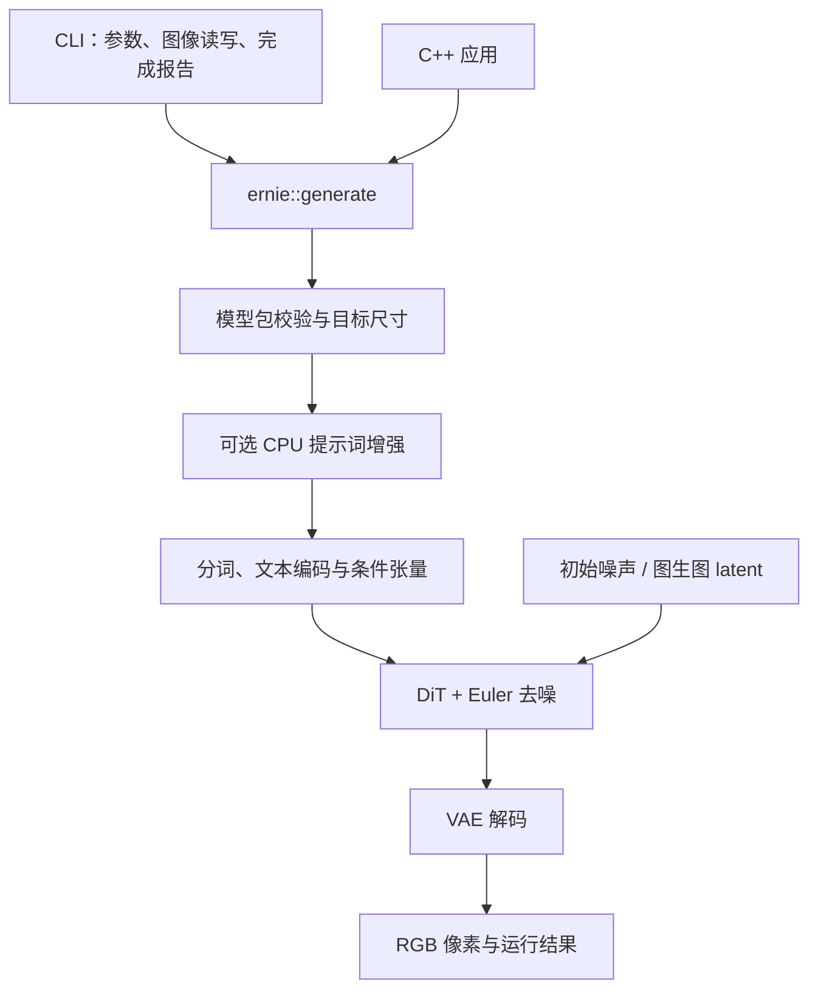

# ernie-image-ncnn-vulkan

ERNIE-Image-Turbo 的 C++ / ncnn / Vulkan 本地文生图实现。提供命令行程序和 C++ 接口，模型准备完成后可离线生成图像，推理不依赖 Python。

[构建与运行](#构建与运行) · [项目架构](#项目架构) · [C++ 接口](#c-接口) · [CI](#ci) · [验证状态](docs/VALIDATION-STATUS.md)

当前定位为 **Linux 技术预览版**，主要实测环境为 RTX 4060 Laptop 8GB、32GB RAM，使用 Turbo、8 步、CFG=1、batch=1。该配置是实测环境，不是最低硬件要求。已有完整 1024×1024 离线生成及多个更大尺寸的实图验证；已知限制见下文。

## 功能

| 功能 | 当前实现 |
|---|---|
| 本地文生图 | 原生分词、文本编码、36 层 DiT、Euler 去噪和 VAE 解码 |
| 运行时尺寸 | 共享包复用权重，按尺寸实例化图，按实际 token 数选择 32/64/2048 文本桶 |
| 提示词增强 | 可选 CPU PE，使用 ncnn 原生 KV cache；完成后释放权重和缓存 |
| 图生图 | 使用带 encoder 的模型包，支持输入图像、强度与显式缩放方式 |
| 内存管理 | 按显存预算选择 GPU/RAM 权重，逐块加载释放；可选有界 RAM 权重缓存 |
| 应用接入 | 命令行、UTF-8 提示词文件、PNG 输出、C++ RGB 接口与进度回调 |

## 项目架构

文生图主路径如下。命令行和其他 C++ 应用共用同一套推理实现。



- **应用边界**：`include/ernie/pipeline.h` 定义请求、结果和回调，只依赖 C++ 标准库。CLI 负责参数和图像文件，流水线返回 RGB 像素。
- **推理边界**：`src/pipeline.cpp` 连接 PE、文本编码、DiT 和 VAE。各组件通过统一的图/权重加载接口使用模型，不处理命令行或下载。
- **资源边界**：PE、文本、DiT、VAE 依次执行，前一阶段权重释放后再进入下一阶段。DiT 逐块管理权重，默认将中间激活保留在 GPU；权重放置策略与 RAM 缓存分别管理。
- **工具边界**：Python 用于下载、转换、打包和官方参考对照；这些工具不进入原生推理链路。

图生图先由 VAE encoder 生成 latent，再按强度进入去噪；`strength=0` 直接走编码后重建。KV cache 用于 PE 自回归生成，DiT 的 K/V 随每步隐藏状态变化，不做跨去噪步的精确复用。

### 目录导航

```text
ernie-image-ncnn-vulkan/
├── include/ernie/       # 对外 C++ 接口
├── cli/                 # 命令行、图像 I/O 和完成报告
├── src/                 # 流水线、模型组件、形状和内存管理
├── tokenizer/           # 原生 Rust tokenizer 与模型包校验
├── cmake/               # ncnn 依赖、构建选项和 SDK 安装
├── tools/               # 下载、转换、打包、参考验证
├── probes/              # 算子与组件诊断程序
├── tests/               # 小型网络、接口、包和安装回归
├── docs/                # 使用说明与架构细节
├── artifacts/           # 已保存的验证报告
└── third_party/         # 固定版本依赖
```

`models/`、`outputs/` 和 `build*/` 是本地数据目录，不进入 Git。模块到源码的对应关系、加载边界和精度处理见 [架构与代码导航](docs/CODE-STRUCTURE.md)。

## 构建与运行

在仓库根目录执行。需要 C++17 编译器、CMake 3.19+、Rust/Cargo 和 libpng 开发库；Vulkan 构建还需要 Vulkan 开发库和可用驱动。

```sh
git submodule update --init --recursive
cmake -S . -B build -DCMAKE_BUILD_TYPE=Release \
  -DERNIE_BUILD_TOKENIZER=ON -DERNIE_BUILD_GENERATOR=ON \
  -DERNIE_INSTALL_SDK=ON \
  -DNCNN_SYSTEM_GLSLANG=OFF -DNCNN_INT8=OFF -DNCNN_WEIGHT_QUANT=OFF
cmake --build build --parallel 2
ctest --test-dir build --output-on-failure
cmake --install build --prefix "$PWD/outputs/install"
```

纯 CPU 构建使用独立目录并加 `-DERNIE_ENABLE_VULKAN=OFF`。只需要用户程序时可加 `-DBUILD_TESTING=OFF -DERNIE_BUILD_PROBES=OFF`。也提供 `linux-cpu` / `linux-vulkan` [CMake presets](CMakePresets.json)，使用 presets 需要 CMake 3.21+ 和 Ninja。

### 准备模型并生成

模型权重不随 Git 仓库提供。先按 [模型准备说明](docs/REPRODUCE-PIPELINE.md) 下载、转换并生成模型包。下面以已有的 `models/turbo1024-s64-portable` 包为例：

```sh
build/ernie-image --model models/turbo1024-s64-portable --verify-model
build/ernie-image --model models/turbo1024-s64-portable \
  --prompt 'A red apple on a wooden table, soft daylight, realistic photo.' \
  --output outputs/apple-new.png --device vulkan --precision fp16 --seed 42 --steps 8
```

输出路径必须不存在。`--verify-model` 检查完整模型包而不启动推理；正常生成也会在加载权重前检查全部运行文件。长提示词可用 `--prompt-file UTF8.txt`；CPU 生成需同时指定 `--device cpu --precision fp32`。

共享包使用 `--width` 和 `--height` 选择尺寸，静态包维持其固定尺寸。可选 PE 通过 `--pe-model` 指定独立模型包。完整参数、图生图、模型打包、动态库依赖及平台说明见 [运行文档](docs/RUNNING.md)。

## C++ 接口

构建并安装 SDK 后，其他 CMake 项目可以链接同一套流水线：

```cmake
find_package(Ernie 0.1.0 EXACT CONFIG REQUIRED)
add_executable(my-app main.cpp)
target_link_libraries(my-app PRIVATE ernie::pipeline)
```

配置应用时指定 `-DCMAKE_PREFIX_PATH=/path/to/installation`。调用示例：

```cpp
#include <ernie/pipeline.h>

int main()
{
    ernie::GenerationRequest request;
    request.model = "models/turbo1024-s64-portable";
    request.prompt = "A red apple on a wooden table.";
    request.seed = 42;
    auto result = ernie::generate(request);
    // result.image.pixels 是 RGB 字节，由应用选择保存或显示方式。
}
```

`generate` 支持进度回调，失败时抛出异常。应用源码无需包含 ncnn 或 PNG 头文件；链接需要兼容的 C++/OpenMP 工具链及系统依赖。当前 Vulkan 上下文为进程级，应串行调用生成接口；0.1.0 不承诺跨工具链稳定二进制 ABI。

## CI

仓库已有 [GitHub Actions 构建工作流](.github/workflows/build.yml)，在 `main` 推送、Pull Request 和手动触发时运行。当前配置覆盖 Linux CPU、Linux Vulkan，以及读取器实验开关开启的 CPU 构建，检查：

- 原生程序与 SDK 编译、小型网络和算子测试。
- CLI、UTF-8 路径、模型包完整性及安装后的独立 C++ 调用。
- 下载器与发布清单的本地 HTTP 测试。

Vulkan 作业安装 Mesa 软件驱动；设备能力不足的测试会显式跳过。CI 不下载 ERNIE 大模型，也不代表真实显卡性能、完整图像质量或 Windows/macOS 已验证。真实模型结果独立记录在 [验证状态](docs/VALIDATION-STATUS.md) 中。

## 当前限制

- 部分中文、长提示词及逐步数值对照仍未通过；出图成功与完整数值一致性分别记录。
- 共享包的实验尺寸范围为每轴 16..2048、16 的倍数、面积不超过 2097152；已验证若干完整尺寸，尚未覆盖每种尺寸和提示词组合。
- 图像文本编码和 VAE 默认使用 CPU。GPU VAE、BF16 等路径仍为实验选项；新 PE 分块预填充目前是内部候选，正常入口仍逐 token 预填充。
- RAM 权重放置已实现；中间激活卸载与显存分配失败后自动恢复尚未实现。
- Windows 已有 MinGW/Wine CPU 开发验证；原生 Windows/MSVC/GPU 和 macOS 尚未验证。当前没有足够数据宣称全面超过参考项目。

## 文档与来源

- [运行参数与 SDK 接入](docs/RUNNING.md)
- [模型下载、转换和打包](docs/REPRODUCE-PIPELINE.md)
- [架构与代码导航](docs/CODE-STRUCTURE.md)
- [转换与验证工具](tools/README.md)
- [实测结果和已知数值差异](docs/VALIDATION-STATUS.md)
- [版本与来源锁定](sources.lock.json)

本项目新增代码使用 [MIT 许可](LICENSE)；ncnn 和模型权重遵循各自许可。官方模型来源为 [Baidu ERNIE-Image](https://github.com/baidu/ERNIE-Image)，运行时依赖 [Tencent ncnn](https://github.com/Tencent/ncnn)。[futz12/ernie-image-ncnn-vulkan](https://github.com/futz12/ernie-image-ncnn-vulkan/tree/8dcd6e4411137d8abe92c9d78581c4c96d5182c6) 等项目用于架构与行为参考，未复制其运行时代码或模型权重到本仓库。
