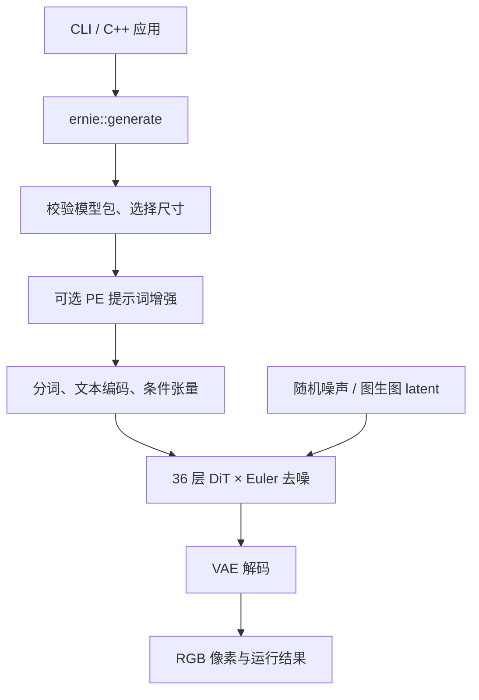

# ernie-image-ncnn-vulkan

用 C++、ncnn 和 Vulkan 在本地运行 ERNIE-Image-Turbo。输入提示词，生成 PNG、JPEG、BMP 或 TGA；模型准备好后可以离线使用，推理不需要 Python。项目提供命令行程序，也可以作为 C++ 库接入其他应用。


> A red apple on a wooden table, soft daylight, realistic photo.

1376×768，8 步，Vulkan FP32。下方两张同样是本项目的原始输出，尺寸均为 1024×1024。

| 白猫与茶壶，英文提示词 | 雪山湖泊，中文提示词 |
|:---:|:---:|
|  |  |

图片来自已完成的对照实验，使用保存的初始噪声。猫和湖泊样例仍有数值检查未通过项，下面的误差表保留了结果。[完整提示词、参数与原图来源](docs/images/README.md)。

目前主要在 Linux 上使用和验证，测试机器是 RTX 4060 Laptop 8GB、32GB RAM，最低配置尚未测定。Windows 和 macOS 已通过原生构建与小型测试，完整模型出图还需要实机验证。首次使用需要自行编译并准备模型包，项目暂未发布预编译 Release。

## 构建与运行

### 编译

需要 C++17 编译器、CMake 3.21+、Ninja、Rust/Cargo、libpng 和 Vulkan 开发库，以及可用的 Vulkan 驱动。构建时还会用 Python 3 核验和处理锁定的 ncnn 源码。

在仓库根目录运行：

```sh
git submodule update --init --recursive
cmake --preset linux-vulkan
cmake --build --preset linux-vulkan --target ernie-image
```

程序位于 `build/linux-vulkan/ernie-image`。只编译这个目标就能生成图片。

纯 CPU 构建使用 `linux-cpu` preset，运行时加 `--device cpu`。CMake 3.19/3.20 或不使用 Ninja 时，按[手动构建说明](docs/RUNNING.md#build-and-install)操作。[Windows 构建](docs/BUILDING-WINDOWS.md)和 [macOS 构建](docs/PLATFORM-VALIDATION.md#覆盖与复现)另有说明。

### 准备模型

程序读取本项目格式的模型包，官方 `.safetensors` 需要先转换。仓库不包含权重；已有模型包可以直接使用，从官方权重开始则需要完成[下载、转换与打包](docs/REPRODUCE-PIPELINE.md)。这一步目前仍需要一些手动操作。

| 模型包 | 使用方式 |
|---|---|
| 固定尺寸包，如 `models/turbo1024-s64-portable` | 尺寸由包确定，直接指定目录 |
| 共享包，如 `models/turbo-shared-v2` | 复用同一套权重，运行时指定宽度和高度；[组装方法](docs/RUNNING.md#shared-weights-and-runtime-dimensions) |
| PE 提示词增强包 | 可选，通过 `--pe-model` 与文生图模型一起使用 |

正常生成会自动校验模型文件。想先确认包是否完整，可以运行：

```sh
build/linux-vulkan/ernie-image --model models/turbo1024-s64-portable --verify-model
```

### 生成第一张图

准备好固定 1024×1024 模型包后：

```sh
build/linux-vulkan/ernie-image --model models/turbo1024-s64-portable \
  --prompt 'A red apple on a wooden table, soft daylight, realistic photo.' \
  --precision fp32 --output outputs/apple.png
```

这里显式选择 FP32，它有更充分的数值对照结果。程序本身的 Vulkan 默认精度是 FP16；CPU 模式省略精度时会选择 FP32。默认运行 8 步、seed 42，显示模型校验、文本编码和逐步去噪进度，最后打印保存路径与耗时。

输出目录会自动创建。已有图片会保留，再次运行时换一个文件名即可。演示图使用的是实验保存的噪声，相同整数 seed 不保证生成与演示图或 PyTorch 逐位相同的结果。

### 常用操作

| 想做什么 | 参数 |
|---|---|
| 使用中文或长提示词 | `--prompt-file prompt.txt`，文件使用 UTF-8，替代 `--prompt` |
| 换一个构图 | `--seed 123` |
| 调整尺寸 | 共享包加 `--width 768 --height 1024` |
| 使用 RAM 存放 DiT 权重 | 默认 `--dit-weights auto` 自动选择，也可指定 `--dit-weights host` |
| 保存本次参数和耗时 | `--report-json outputs/run.json` |
| 开启提示词增强 | `--pe-model /path/to/pe-package`；`--pe-greedy` 使用贪心解码 |
| 图生图 | 带 encoder 的包加 `--input source.png --strength 0.5`；[缩放与示例](docs/RUNNING.md#reviewed-image-to-image-package-and-cli) |
| 查看显卡或选择设备 | `--diagnose` 查看可用设备，`--gpu N` 选择显卡 |

例如，用共享包生成一张竖图：

```sh
build/linux-vulkan/ernie-image --model models/turbo-shared-v2 \
  --prompt-file prompt.txt --width 768 --height 1024 \
  --precision fp32 --output outputs/portrait.png
```

`--help` 显示常用选项，`--help-all` 显示全部参数。缓存、预取和显存预算通常可以先保持默认。

## 与官方的实测误差

对照使用相同提示词和保存的初始 FP32 噪声，原生端执行自己的分词、文本编码、DiT 和 VAE。官方参考由锁定的组件分阶段运行，DiT 使用 CUDA FP32；PE 关闭，CFG=1。以下结果衡量与该参考的数值接近程度，画质还需要结合提示词和实际图片判断。

像素差按 RGB 通道的 **0..255** 数值计算。张量检查表示 25 个中间结果中有多少通过本项目的误差门槛，这些门槛由项目定义。每行对应一次已保存的运行。

| 样例 | DiT 精度 | 像素平均差 MAE | 最大差 | 张量检查 |
|---|---|---:|---:|---:|
| 苹果，512×512 | FP32 | 0.000361125 | 1 | 25/25 |
| 苹果，512×512，默认精度 | FP16 | 0.235983531 | 109 | 23/25 |
| 苹果，512×512，修正后的 BF16 路径 | BF16 | 1.294207255 | 143 | 17/25 |
| 本页苹果，1376×768 | FP32 | 0.000617291 | 1 | 25/25 |
| 本页白猫，40-token 英文，1024×1024 | FP32 | 0.002676964 | 1 | 24/25 |
| 本页湖泊，中文，1024×1024 | FP32 | 0.022625605 | 13 | 21/25 |
| 1080-token 中文，512×384 | FP32 | 0.082126194 | 17 | 19/25 |
| 同一 1080-token 中文 | BF16 | 10.376324124 | 255 | 11/25 |

512×512 三行来自 9 月 9 日的[内存执行回归](artifacts/2026-09-08/memory-execution/README.md)，其他行来自 9 月 6、7 日的运行。正常与混合内存 FP32 的 25 份张量和 PNG 都与旧版逐位相同；默认 FP16 也保持原输出，对官方的 23/25 和最大像素差 109 没有改变。

BF16 的注意力和 Gemm 路径修复了非法 Vulkan 用法，新路径仍未通过完整数值检查。它和历史 ncnn 升级时的 BF16 18/25、最大差 98 分开记录。中文分词已与官方对齐，但现有样例同时涉及文本长度、模型来源和精度差异，尚未隔离语言本身的影响。

更多尺寸、早期未通过项、版本和比较方法放在[数值结果明细](docs/NUMERICAL-RESULTS.md)。其中保留了 768×768 的 18/25、1024×1024 的 24/25，以及旧固定 1376×768 样例的 23/25、最大像素差 3。展示这些图片不意味着所有提示词或尺寸都已通过检查，也没有足够的同条件数据给本项目和其他移植做质量排名。

## 技术实现

文本先经过原生 tokenizer 和 Mistral 编码器。程序执行前 25 层，取 `hidden_states[-2]`，得到每个 token 的 3072 维特征。文本只编码一次，随后供去噪循环使用。

DiT 将文本和图像 latent（潜变量）投影到 4096 维，拼成一个序列，经过 36 层 Transformer。1024×1024 图片对应 `64×64=4096` 个图像位置，加上 64 个文本槽，共 4160 个位置；mask 排除无效文本 padding。每一步都运行完整的 DiT，用 Euler 方法更新 latent：

```text
v_i     = DiT(z_i, text_features, timestep_i)
z_{i+1} = z_i + (sigma_{i+1} - sigma_i) * v_i
```

`v_i` 是预测的流速度，`sigma` 从 1 降到 0。Turbo 默认执行 8 步，CFG=1，无需额外的无条件分支。结束后反归一化，将 128 通道的打包 latent 还原成 32 通道，再由 VAE 解码为 RGB。默认文本编码与 VAE 在 CPU 上执行，DiT 在 Vulkan 上执行。

ncnn 负责图执行和底层算子；C++ 负责组件调度、条件张量、Euler 更新和内存生命周期。ERNIE 特有的 RoPE、GELU、归一化与残差处理保留在对应组件中。图生图增加 VAE encoder，并按强度选择去噪起点；`strength=0` 直接重建输入图像。

### 内存与精度

PE、文本编码、DiT 和 VAE 依次加载，阶段结束后释放权重。DiT 按块执行，块间激活尽量留在 GPU 上。FP32 注意力一次最多处理 128 行 query，每行保留全部 K/V；4160-token、32 头的单个分数矩阵从约 2.06 GiB 缩到 65 MiB，代价是更多提交和同步。CPU VAE 默认使用直接卷积，关闭 Winograd 和 SGEMM，以减少已观测到的大尺寸工作区压力。

| 机制 | 默认行为 |
|---|---|
| 权重放置 | `--dit-weights auto`，根据预算选择 GPU 或 RAM；RAM 权重仍用于 Vulkan 计算 |
| 权重缓存与后台预取 | 默认都关闭。Vulkan FP32、auto/host 权重下，可分别用 `--dit-cache-mib` 和 `--dit-prefetch-mib` 开启；预取最多提前准备一块 |
| 激活与工作区 | `--gpu-memory auto --gpu-spill-mib 2048`，为 DiT 新缓冲区选择 GPU 或 GPU 可访问的 RAM |
| 分配失败恢复 | `--oom-retries 3`，每步保存 CPU 检查点，失败时从最近完成的步骤重建执行 |

一次 512×512 实测中，混合配置使用了 288 次 RAM buffer 分配，峰值 192 MiB，280 次预取全部被消费。它耗时 420.948 秒，正常 FP32 为 258.230 秒。这两次开启了 trace，多个设置同时变化，页缓存和桌面负载也未控制，结果没有证明预取能加速；内存成本、逐次分配和部分全 RAM 运行保存在[实测明细](docs/NUMERICAL-RESULTS.md#内存执行改动后的完整回归)。

恢复时会关闭额外缓存和预取，自动模式优先使用 RAM，并将 FP32 非 Flash 查询分块逐级缩为 64、32、16 行。分辨率、精度、步数、调度和完整 K/V 保持原设置。设备丢失、普通模型错误和清理同步失败直接报错；部分 ncnn 创建操作若只返回通用错误，也无法进入恢复。已有活动 buffer 的任意换页、文本/PE/VAE 恢复和进程重启续跑尚未实现。[内存执行教程](docs/MEMORY-EXECUTION.md)解释了分配器、预取线程、检查点和错误传播的具体做法。

精度敏感的位置单独处理：残差、归一化中间计算和 Euler 主 latent 保留 FP32，避免 FP16 溢出；FP32 注意力使用 Kahan 补偿累加，CPU VAE 的均值和中心方差使用 FP64。文件中的 BF16 权重存储与运行时 BF16 计算分别控制。计算顺序和多步误差传播会影响结果，具体未通过项仍需逐阶段定位。

可选 PE 是 26 层的自回归提示词增强器，使用 ncnn 原生 KV cache；正常入口逐 token 预填充。图像 DiT 的隐藏状态每步都会变化，因此其 K/V 没有跨去噪步骤复用。

## 项目架构

命令行和 C++ 应用共用 `ernie::generate`。CLI 处理参数、图片文件和终端进度，流水线返回 RGB 像素，不要求调用方使用同一套图像 I/O。



| 代码位置 | 职责 |
|---|---|
| [`include/ernie/pipeline.h`](include/ernie/pipeline.h)、[`cli/`](cli) | 对外请求、结果与回调；命令行、UTF-8 提示词和图像文件处理 |
| [`pipeline.cpp`](src/pipeline.cpp) | 连接各阶段，在阶段切换时释放权重 |
| [`prompt_enhancer.cpp`](src/prompt_enhancer.cpp)、[`pe_session.cpp`](src/pe_session.cpp) | PE 采样和 KV cache 会话 |
| [`text_encoder.cpp`](src/text_encoder.cpp)、[`conditioning.cpp`](src/conditioning.cpp) | 文本特征、位置编码和 mask |
| [`denoiser.cpp`](src/denoiser.cpp)、[`dit.cpp`](src/dit.cpp)、[`block_sequence.cpp`](src/block_sequence.cpp) | Euler 步进、单步预测、逐块加载及预取 |
| [`vae.cpp`](src/vae.cpp)、[`latent_ops.cpp`](src/latent_ops.cpp) | 编解码、latent 格式转换 |
| [`model_package.cpp`](src/model_package.cpp)、[`shape_plan.cpp`](src/shape_plan.cpp) | 模型包校验、目标尺寸和文本桶选择 |
| [`weight_placement.cpp`](src/weight_placement.cpp)、[`weight_session.cpp`](src/weight_session.cpp) | 权重位置和可选缓存 |
| [`vulkan_memory.cpp`](src/vulkan_memory.cpp)、[`vulkan_denoise.cpp`](src/vulkan_denoise.cpp) | 缓冲区预算、检查点和重试 |

`src/` 保持浅层目录。改 PE 采样看 `prompt_enhancer`，改 Euler 步进看 `denoiser`，增加图片格式看 `cli`；公共 API 只依赖 C++ 标准库。更详细的张量形状和模块关系在[代码导航](docs/CODE-STRUCTURE.md)中。

Python 下载、转换、打包和参考工具放在 `tools/`；原生 tokenizer 与包校验在 `tokenizer/`；依赖和安装配置在 `cmake/`。`probes/` 用于组件诊断，`tests/` 用于回归，`artifacts/` 保存实测报告。模型、构建产物和批量生成结果留在本地，README 的三张原图单独放在 `docs/images/`。

## C++ 接口

Linux preset 已启用 SDK。安装后，其他 CMake 项目可以直接链接：

```sh
cmake --install build/linux-vulkan --prefix "$PWD/outputs/install"
```

```cmake
find_package(Ernie 0.1.0 EXACT CONFIG REQUIRED)
add_executable(my-app main.cpp)
target_link_libraries(my-app PRIVATE ernie::pipeline)
```

配置应用时传入 `-DCMAKE_PREFIX_PATH=/path/to/installation`。调用示例：

```cpp
#include <ernie/pipeline.h>

int main()
{
    ernie::GenerationRequest request;
    request.model = "models/turbo1024-s64-portable";
    request.prompt = "A red apple on a wooden table.";
    request.precision = "fp32";
    request.seed = 42;
    auto result = ernie::generate(request);
    // result.image.pixels 是 RGB 字节，可自行保存或显示。
}
```

`generate` 支持进度回调，失败时抛出异常。当前应串行调用生成接口。应用无需包含 ncnn 或 PNG 头文件，链接仍需要兼容的 C++/OpenMP 工具链和系统依赖；0.1.0 暂不保证跨工具链的稳定二进制 ABI。CPU 构建使用对应安装目录，接口设置见 [SDK 说明](docs/RUNNING.md#build-and-install)。

## CI

[GitHub Actions](.github/workflows/build.yml)覆盖 Linux、Windows MSVC 和 macOS Apple Clang，检查原生程序、tokenizer、CLI、Unicode 路径、模型包和搬移安装后的 C++ 调用。工作流在 `main` 和验证分支推送、Pull Request 或手动触发时运行。

内存执行版本的[最近一次代码验证](https://github.com/mingshi2333/ernie-image-ncnn-vulkan/actions/runs/34373124004)结果如下：

| 环境 | 通过 | 跳过 | 原因 |
|---|---:|---:|---|
| Linux CPU，读取器 OFF / ON | 各 37 | 0 | 两个独立构建 |
| Linux Mesa Vulkan | 57 | 5 | CI 驱动缺少原生 BF16 storage |
| macOS MoltenVK | 57 | 5 | 托管虚拟 GPU 缺少原生 BF16 storage |
| Windows MSVC | 37 | 25 | 运行器没有 Vulkan 驱动 |
| 本机 Linux / RTX 4060 Laptop | 62 | 0 | Vulkan 与 BF16 测试实际执行，校验层无错误 |

上述均无失败，五个远程作业另外各通过 23 项 HTTP/模型清单检查，本机纯 CPU 另有 37 项通过。Linux Vulkan CI 使用固定的 SDK 1.4.357.1 校验层并检查 VUID；其他远程平台未启用该校验层。CI 不下载 ERNIE 权重，完整出图采用独立实机实验。[平台记录](docs/PLATFORM-VALIDATION.md)保留构建失败、修复过程和每项跳过原因。

## 当前限制

- 部分长提示词、中文和逐步数值对照尚未通过，BF16 与 GPU VAE 保持实验状态。新的 PE 分块预填充也是内部候选，日常入口仍逐 token 预填充。
- 共享包接受每轴 16..2048、16 的倍数、面积不超过 2097152 的实验尺寸范围。已执行过若干完整尺寸，尚未覆盖所有形状与提示词组合。
- 自动 RAM 分配与恢复只覆盖 DiT。macOS 尚无生产 RAM 余量读取器，Windows Job/Wine 同样返回余量未知；这些环境的 host 缓冲区准入会被拒绝，显式 host 也无法绕过。
- Windows/macOS 的完整模型、物理 Mac 行为和真实设备性能仍需补充验证。跨后端的数值差异与性能结论以各自实测范围为准。

## 文档与来源

- [运行参数与 SDK](docs/RUNNING.md) · [模型准备](docs/REPRODUCE-PIPELINE.md) · [转换工具](tools/README.md)
- [架构细节](docs/CODE-STRUCTURE.md) · [内存执行教程](docs/MEMORY-EXECUTION.md) · [数值结果明细](docs/NUMERICAL-RESULTS.md)
- [验证状态](docs/VALIDATION-STATUS.md) · [平台记录](docs/PLATFORM-VALIDATION.md)
- [ncnn 社区技术分享](https://github.com/Tencent/ncnn/discussions/6985) · [文章源码](docs/NCNN-DISCUSSION-DRAFT.md) · [给其他项目的复用说明](docs/PORTING-REUSE-GUIDE.md)

ncnn 目前锁定在 `3b7bdba7`，以后优先跟进上游 Git，并固定通过验证的提交。更新仓库后同步子模块即可；旧 `6a1bf000` 模型包仍兼容，包内来源和文件校验保持不变。完整版本在 [sources.lock.json](sources.lock.json) 中。

本项目新增代码使用 [MIT 许可](LICENSE)，ncnn 与模型权重遵循各自许可。模型来自 [Baidu ERNIE-Image](https://github.com/baidu/ERNIE-Image)，运行时使用 [Tencent ncnn](https://github.com/Tencent/ncnn)。[futz12/ernie-image-ncnn-vulkan](https://github.com/futz12/ernie-image-ncnn-vulkan/tree/8dcd6e4411137d8abe92c9d78581c4c96d5182c6) 等项目提供了架构与行为参考，其运行时代码和模型权重未复制进本仓库。
