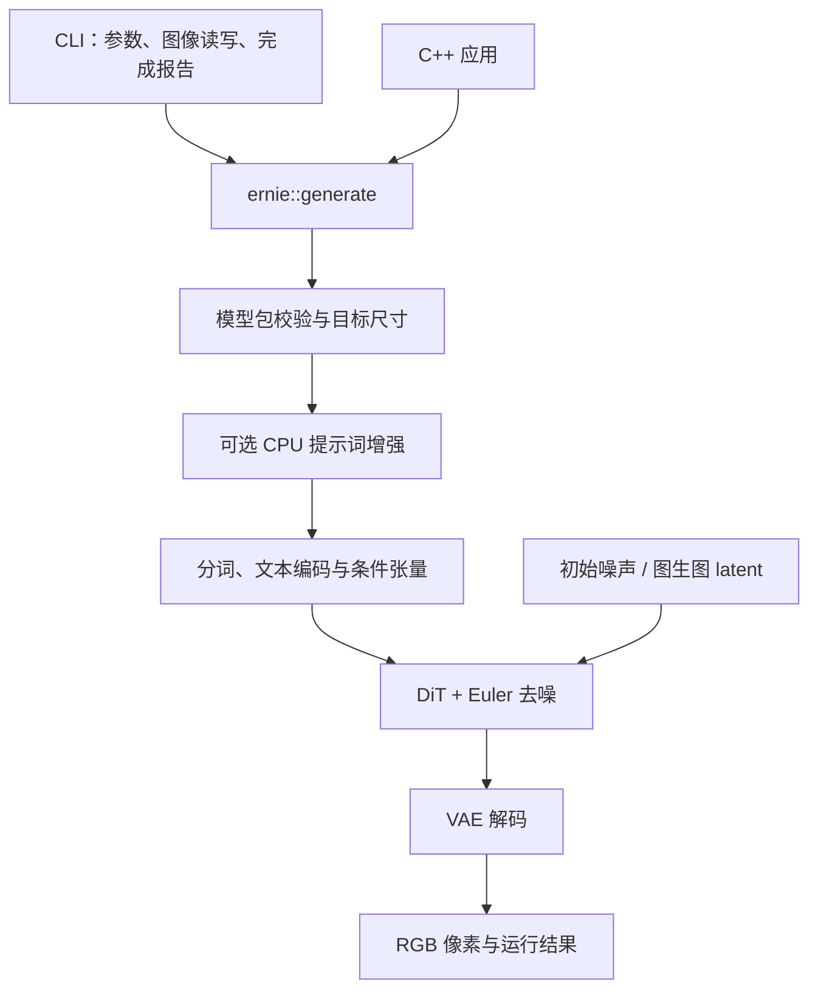

# ernie-image-ncnn-vulkan

ERNIE-Image-Turbo 的 C++ / ncnn / Vulkan 本地文生图实现。提供命令行程序和 C++ 接口；准备好模型后，可以离线生成 PNG、JPEG、BMP 或 TGA，推理不依赖 Python。

[生成第一张图](#构建与运行) · [常用操作](#常用操作) · [与官方的实测误差](#与官方的实测误差) · [技术实现](#技术实现) · [项目架构](#项目架构) · [C++ 接口](#c-接口) · [CI](#ci)

当前为 **Linux 技术预览版**，主要实测环境是 RTX 4060 Laptop 8GB、32GB RAM，使用 Turbo、8 步、CFG=1、batch=1。已完成 1024×1024 离线生成和多种更大尺寸实图对照。这是已测试的环境，不是最低硬件要求。

## 当前是否可以使用

在已测试的 Linux / Turbo / FP32 配置下，原生文生图主流程可以使用，已有完整实图与官方分阶段参考对照。日常使用先采用下面显式指定 FP32 的命令。这里的“可用”对应已保存的运行结果，不承诺任意提示词、尺寸和设备都通过全部数值检查。

- 部分尺寸、长提示词和中文样例仍有中间张量未通过项，BF16 长提示词误差明显，保持实验状态；具体数字见[误差表](#与官方的实测误差)。
- GPU/RAM 权重放置和逐块加载已经实现。激活与注意力工作区仍需要设备资源，激活卸载及分配失败后的自动恢复尚未实现。
- 第一次使用仍需准备本项目格式的模型包。三平台编译、无大模型测试与完整出图分别记录，不能用构建通过代替实际图像验证，见[平台验证](docs/PLATFORM-VALIDATION.md)。

移植过程、转换命令和遇到的问题整理为 [ncnn Discussions 教程草稿](docs/NCNN-DISCUSSION-DRAFT.md)。草稿尚未发布。

## 构建与运行

### 1. 编译程序

在仓库根目录执行。下面使用已有的 CMake presets，需要 C++17 编译器、CMake 3.21+、Ninja、Rust/Cargo 和 libpng 开发库；GPU 构建还需要 Vulkan 开发库和可用驱动。

```sh
git submodule update --init --recursive
cmake --preset linux-vulkan
cmake --build --preset linux-vulkan --target ernie-image
```

得到 `build/linux-vulkan/ernie-image`。只构建上述目标即可出图；测试和诊断程序可在需要时构建。纯 CPU 构建把两条命令中的 preset 名称换成 `linux-cpu`，得到 `build/linux-cpu/ernie-image`，生成时加 `--device cpu`。不使用 Ninja 或仅有 CMake 3.19/3.20 时，使用 [手动构建命令](docs/RUNNING.md)。

### 2. 准备模型

程序需要**本项目格式的模型包**，Git 仓库不包含权重。已有模型包的用户直接指定目录即可；首次从官方权重准备模型仍需要下载、转换和打包，见 [模型准备步骤](docs/REPRODUCE-PIPELINE.md)。官方 `.safetensors` 文件不能直接作为 `--model` 的输入。

| 手头的模型 | 如何使用 |
|---|---|
| 固定尺寸原生包，例如 `models/turbo1024-s64-portable` | 直接指定 `--model`，尺寸由包确定 |
| 共享原生包，例如 `models/turbo-shared-v2` | 指定 `--model`、`--width` 和 `--height`；[共享包组装说明](docs/RUNNING.md#shared-weights-and-runtime-dimensions) |
| 独立 PE 包 | 文生图模型之外的可选项，通过 `--pe-model` 开启提示词增强 |

正常生成会自动校验全部模型文件。只检查模型是否完整时运行：

```sh
build/linux-vulkan/ernie-image --model models/turbo1024-s64-portable --verify-model
```

### 3. 生成第一张图

以下假设已准备好固定 1024×1024 模型包。显式选择 FP32，便于使用下方有完整对照记录的精度路径。

```sh
build/linux-vulkan/ernie-image --model models/turbo1024-s64-portable \
  --prompt 'A red apple on a wooden table, soft daylight, realistic photo.' \
  --precision fp32 --output outputs/apple.png
```

默认 8 步、seed 42，运行时显示模型校验、文本编码和每步去噪进度，结束后显示图像路径与耗时。输出目录自动创建；已有图片保留，再次生成时换一个文件名。Vulkan CLI 的默认精度仍为 FP16；下方 FP32 数据只对应表中列明的实验配置。

### 常用操作

| 需求 | 用法 |
|---|---|
| 中文或长提示词 | 把提示词保存为 UTF-8 文件，用 `--prompt-file prompt.txt` 替代 `--prompt` |
| 生成不同构图 | 修改 `--seed 123`；同一整数 seed 不保证与 PyTorch 的初始噪声相同 |
| 纯 CPU 推理 | 加 `--device cpu`，省略精度时自动选择 FP32 |
| 调整尺寸 | 使用共享包并加 `--width 768 --height 1024`；固定包保留自己的尺寸 |
| 小显存下使用 RAM 权重 | 默认 `--dit-weights auto` 按预算选择；也可显式指定 `--dit-weights host` |
| 保存运行参数和结果 | 加 `--report-json outputs/run.json`，记录本次配置、提示词和耗时 |
| 提示词增强 | 加 `--pe-model /path/to/pe-package`；`--pe-greedy` 使用贪心解码 |
| 图生图 | 使用带 encoder 的包，加 `--input source.png --strength 0.5`；[缩放与完整示例](docs/RUNNING.md#reviewed-image-to-image-package-and-cli) |

共享包的完整命令示例：

```sh
build/linux-vulkan/ernie-image --model models/turbo-shared-v2 \
  --prompt-file prompt.txt --width 768 --height 1024 \
  --precision fp32 --output outputs/portrait.png
```

直接运行程序或加 `-h` / `--help` 查看常用选项，`--help-all` 查看完整参数。`--diagnose` 不加载权重，可用于查看可用显卡；选定显卡使用 `--gpu N`。内存策略、模型读取方式、采样和诊断参数见 [完整运行说明](docs/RUNNING.md)。

## 功能

| 功能 | 当前实现 |
|---|---|
| 本地文生图 | 原生分词、文本编码、36 层 DiT、Euler 去噪和 VAE 解码 |
| 运行时尺寸 | 共享包复用权重，按尺寸实例化图，按实际 token 数选择 32/64/2048 文本桶 |
| 提示词增强 | 可选 CPU PE，使用 ncnn 原生 KV cache；完成后释放权重和缓存 |
| 图生图 | 使用带 encoder 的模型包，支持输入图像、强度与显式缩放方式 |
| 内存管理 | 按显存预算选择 GPU/RAM 权重，逐块加载释放；可选有界 RAM 权重缓存 |
| 应用接入 | 命令行、UTF-8 提示词文件、PNG/JPEG/BMP/TGA 输出、C++ RGB 接口与进度回调 |

## 与官方的实测误差

以下数据来自 **2026-09-06 / 07 保存的真实完整生成结果**。原生端实际执行分词、文本编码、8 步去噪和 VAE；官方端使用锁定版本的分阶段实现。每对结果使用相同提示词和同一份保存的初始 FP32 噪声，PE 关闭、CFG=1。FP32 行使用 Vulkan FP32 DiT、CPU 文本编码和 CPU VAE；这里没有用官方文本特征替换原生文本编码。

- **平均通道差（MAE）**：两张 PNG 所有 RGB 通道绝对差的平均值，数值越小越接近。
- **最大通道差**：单个 RGB 通道的最大绝对差。两列均使用 **0–255** 的原始像素范围，最大差 1 表示相差一个灰度级。
- **张量检查**：保存的中间结果通过了多少项项目诊断门槛。这些门槛由本项目定义，不是官方质量标准，也不是视觉相似度评分。

### 简短英文苹果提示词，FP32

共享 source32 模型包，15 个实际 token、64 个 DiT 文本槽；正常原生文本编码参与。原生程序快照为 `92559ea4`，源码基线为 `990e8ef`。表中数字属于这些已保存的运行，不冒充后续每个提交都重跑过的结果。

| 输出尺寸 | 平均通道差 MAE（0–255） | 最大通道差（0–255） | 张量检查 | 记录 |
|---|---:|---:|---:|---|
| 512×512 | 0.000361125 | 1 | 25/25 | [原始报告](artifacts/2026-09-07/runtime-images-and-sdk/README.md) |
| 768×768 | 0.027716743 | 2 | 18/25 | [原始报告](artifacts/2026-09-07/runtime-squares/README.md) |
| 1024×1024 | 0.000761032 | 1 | 24/25 | [原始报告](artifacts/2026-09-07/runtime-squares/README.md) |
| 1376×768 | 0.000617291 | 1 | 25/25 | [原始报告](artifacts/2026-09-07/runtime-large/README.md) |
| 768×1376 | 0.001759137 | 1 | 25/25 | [原始报告](artifacts/2026-09-07/runtime-large/README.md) |
| 2048×1024 | 0.001831373 | 1 | 25/25 | [原始报告](artifacts/2026-09-07/runtime-large/README.md) |
| 1024×2048 | 0.000875314 | 1 | 25/25 | [原始报告](artifacts/2026-09-07/runtime-large/README.md) |

这些图片均完整生成，并已查看实际苹果图像。768 和 1024 的中间张量仍有未过项，最终图片差异较小；完整数值一致性仍按原记录保留。旧固定 source64 / 1376×768 样例的最大通道差 3、23/25 结果也[单独保留](artifacts/2026-09-07/fixed1376-native-pipeline/README.md)，不能被新来源的通过记录覆盖。

### 长提示词与中文样例

下表为各自已保存的较早完整运行，模型来源、文本长度和精度不同，不能只按语言解释差异。

| 提示词 / 尺寸 | 精度 | 平均通道差 MAE（0–255） | 最大通道差（0–255） | 张量检查 |
|---|---|---:|---:|---:|
| 40-token 英文，1024×1024 | FP32 | 0.002676964 | 1 | 24/25 |
| 中文，1024×1024 | FP32 | 0.022625605 | 13 | 21/25 |
| 1080-token 中文，512×384 | FP32 | 0.082126194 | 17 | 19/25 |
| 同一 1080-token 中文，512×384 | BF16 | 10.376324124 | 255 | 11/25 |

来源：[长英文与中文 FP32 对照](artifacts/2026-09-06/attention-parity/README.md)、[1080-token FP32 / BF16 对照](artifacts/2026-09-06/features-and-structure/README.md)。已测中文分词与官方一致，现有对照尚未隔离“语言”本身；文本条件的数值差异和去噪中的误差传播仍需区分。BF16 保持实验状态。

这些结果用于说明移植与官方的数值接近程度，不代表所有提示词的画质评分，也没有建立全面优于其他移植的结论。更完整的图生图、PE、内存和平台证据见 [验证状态](docs/VALIDATION-STATUS.md)。

## 技术实现

### 模型如何把提示词变成图像

ERNIE-Image-Turbo 在压缩后的图像表示 **latent（潜变量）** 上执行 Flow Matching 生成：从随机噪声出发，用文本条件引导更新，最后由 VAE 将 latent 解码为 RGB。默认文本编码在 CPU 上执行，DiT 在 Vulkan 上执行，VAE 在 CPU 上执行。

1. **文本条件只编码一次。** 原生 tokenizer 将提示词变成 token IDs，Mistral 文本编码器执行前 25 层，取官方要求的 `hidden_states[-2]`，得到每个有效 token 的 3072 维特征。它提供描述图像的条件，不负责输出图片或继续生成文字。
2. **DiT 让文字和图像共同参与注意力。** 图像 latent 和文本特征分别投影到 4096 维，再拼成一个序列，经过 36 层 Transformer。以 1024×1024、64 个文本槽为例，图像有 `64×64=4096` 个位置，联合序列有 `4096+64=4160` 个位置。全局注意力让图像位置读取文本和其他图像位置；mask 排除无效文本 padding。
3. **去噪循环逐步更新整张图的 latent。** 每步 DiT 预测当前 latent 的更新方向，Euler 根据相邻噪声尺度更新状态。默认执行 8 步，每步都运行完整 36 层；CFG=1 时无需额外的无条件分支。

更新规则对应当前实现：

```text
v_i     = DiT(z_i, text_features, timestep_i)
z_{i+1} = z_i + (sigma_{i+1} - sigma_i) * v_i
```

`z_i` 是当前 latent，`v_i` 是模型预测的流速度，`sigma` 是从 1 降到 0 的噪声尺度。结束后先按模型统计量反归一化，将 128 通道的打包 latent 还原成 32 通道，再经 VAE 解码和像素量化得到图片。完整形状、位置编码和调度公式见 [推理数据与计算](docs/CODE-STRUCTURE.md#推理数据与计算)。

### ncnn 执行什么，C++ 负责什么

准备模型时，用锁定的官方权重导出文本层、DiT 输入/输出头、DiT blocks 和 VAE 图，通过 pnnx 转换为 ncnn 的 `.param` 图与 `.bin` 权重。模型包记录来源和文件校验信息；高分辨率 VAE、运行时尺寸等有各自受限的图适配步骤。

运行时，**ncnn 负责算子执行，C++ 负责生成过程和资源生命周期**。C++ 载入组件图、提交 CPU/Vulkan 运算、执行 Euler 更新，并在安全的阶段边界释放权重。图像生成不再导入 PyTorch；Rust tokenizer 已静态链接到原生程序。实现还保留 ERNIE 的三轴 RoPE、shared AdaLN、erf GELU 和特定归一化行为，不能仅凭算子名称相同就替换数学定义。[转换与执行细节](docs/CODE-STRUCTURE.md#从官方组件到-ncnn-执行)

### 为什么能在有限显存上运行

| 实现 | 原理与代价 |
|---|---|
| 分阶段、逐块加载 | PE、文本、DiT、VAE 依次使用资源；DiT 默认只保留当前块的权重，执行完成后释放。降低同时驻留量，但增加重复读取和权重准备 |
| GPU/RAM 权重放置 | 加载块前查询显存预算，结合权重估计和预留空间选择放置位置。RAM 权重仍用于 Vulkan 计算，访问成本取决于设备；这是权重放置，不包含激活卸载或失败后自动重试 |
| FP32 注意力按查询分块 | 每次最多计算 128 个 query，但保留完整 K/V 和可见上下文。4160-token、32 头的单个分数矩阵由约 2.06 GiB 降到 65 MiB，代价是增加提交和同步；该数字不是整个进程的显存峰值 |
| CPU VAE 直接卷积 | 默认关闭 Winograd 和 SGEMM 路径，减少本项目已观测到的大尺寸工作区压力；运行速度仍取决于硬件和输入 |

RAM 权重缓存另有独立容量限制，默认关闭；内存允许时可以复用部分已准备的块，避免每一步都重新加载。它与权重文件映射、GPU 放置是不同选项，详见 [内存与缓存](docs/CODE-STRUCTURE.md#内存与缓存)。

### KV cache 与精度处理

**KV cache 用于可选的 PE 提示词增强。** PE 是自回归语言模型，每次生成新 token 时，历史 token 的 K/V 可以继续使用。本项目通过 ncnn 原生缓存接口维护独立会话和容量，正常入口仍逐 token 预填充。图像 DiT 的隐藏状态会随每一步去噪变化，即使原始文本特征相同，联合注意力中的文本状态也会变化，所以不把上一去噪步的 K/V 当作精确缓存使用。

**精度按数值敏感点处理。** FP16 可能在残差相加或归一化的中间计算中溢出，因此这些位置保留/提升到 FP32，Euler 主 latent 也始终保持 FP32。FP32 注意力使用 Kahan 补偿累加，减小长求和中的舍入损失；CPU VAE 的均值和中心方差归约使用 FP64。权重文件中的 BF16 存储与运行时 BF16 计算是两回事，前者不代表整条计算路径都使用 BF16。

同一数学公式在不同后端上也可能因计算顺序和精度产生差异，多步去噪又会传播已有差异。PyTorch 同样不保证跨平台计算逐位一致，见其 [数值精度说明](https://docs.pytorch.org/docs/2.14/notes/numerical_accuracy.html)。这只能解释误差可能产生的机制，具体未通过样例仍需用阶段对照定位，不能因此直接认定所有偏差都正常。上方误差表保留当前实测结果。

## 项目架构

代码按**推理阶段和资源职责**组织：CLI 收集输入，公共接口接收请求，流水线调用模型组件。命令行和其他 C++ 应用共用同一套推理实现。



- **应用边界**：`include/ernie/pipeline.h` 定义请求、结果和回调，只依赖 C++ 标准库。CLI 负责参数和图像文件，流水线返回 RGB 像素。
- **推理边界**：`src/pipeline.cpp` 连接 PE、文本编码、DiT 和 VAE。各组件通过统一的图/权重加载接口使用模型，不处理命令行或下载。
- **资源边界**：PE、文本、DiT、VAE 依次执行，前一阶段权重释放后再进入下一阶段。DiT 逐块管理权重，默认将中间激活保留在 GPU；权重放置策略与 RAM 缓存分别管理。
- **工具边界**：Python 用于下载、转换、打包和官方参考对照；这些工具不进入原生推理链路。

### 推理阶段与源码对应

| 执行阶段 | 主要源码 | 做什么、为什么放在这里 |
|---|---|---|
| 用户入口 | [`cli/main.cpp`](cli/main.cpp)、[`cli/options.cpp`](cli/options.cpp) | 参数、提示词文件、进度和图片保存集中在应用层，模型组件无需了解终端和文件格式 |
| 公共请求 | [`include/ernie/pipeline.h`](include/ernie/pipeline.h) | 暴露 `GenerationRequest`、RGB 结果和回调；其他 C++ 程序直接复用 |
| 阶段调度 | [`src/pipeline.cpp`](src/pipeline.cpp) | 校验包、连接阶段、收集结果，在阶段交接时释放权重 |
| 可选提示词增强 | [`prompt_enhancer.cpp`](src/prompt_enhancer.cpp)、[`pe_session.cpp`](src/pe_session.cpp) | 26 层 Ministral3 生成增强提示词；采样与 KV cache 会话各自管理 |
| 图像文本编码 | [`text_encoder.cpp`](src/text_encoder.cpp)、[`conditioning.cpp`](src/conditioning.cpp) | Mistral 前 25 层取 `hidden_states[-2]`，准备文本条件、位置和 mask |
| 反复去噪 | [`denoiser.cpp`](src/denoiser.cpp)、[`dit.cpp`](src/dit.cpp)、[`block_sequence.cpp`](src/block_sequence.cpp) | Euler 管时间步与 latent 更新，DiT 管单步预测，块执行器管理 36 层的逐块加载；Turbo 默认循环 8 步 |
| 图像解码 | [`vae.cpp`](src/vae.cpp)、[`latent_ops.cpp`](src/latent_ops.cpp) | latent 格式转换与 VAE 解码，最终由流水线返回 RGB 像素 |
| 模型与内存 | [`model_package.cpp`](src/model_package.cpp)、[`shape_plan.cpp`](src/shape_plan.cpp)、[`weight_placement.cpp`](src/weight_placement.cpp)、[`weight_session.cpp`](src/weight_session.cpp) | 包校验、尺寸和文本桶选择、GPU/RAM 放置及可选缓存集中复用 |

这样组织后，修改采样只涉及 PE，修改 Euler 步进进入 denoiser，增加图片格式进入 CLI；模型算子保持在对应组件，公共 API 不暴露 ncnn 私有类型。`src/` 保持浅层目录，避免为了单个模型增加多模型注册或插件框架。

图生图先由 VAE encoder 生成 latent，再按强度进入去噪；`strength=0` 直接走编码后重建。KV cache 用于 PE 自回归生成，DiT 的 K/V 随每步隐藏状态变化，不做跨去噪步的精确复用。

### 目录导航

```text
ernie-image-ncnn-vulkan/
├── include/ernie/       # 对外 C++ 接口
├── cli/                 # 命令行、图像 I/O 和完成报告
├── src/                 # 流水线、模型组件、形状和内存管理
├── tokenizer/           # 原生 Rust tokenizer 与模型包校验
├── cmake/               # ncnn 依赖、构建选项和 SDK 安装
├── tools/               # 下载、转换、打包、参考验证
├── probes/              # 算子与组件诊断程序
├── tests/               # 小型网络、接口、包和安装回归
├── docs/                # 使用说明与架构细节
├── artifacts/           # 已保存的验证报告
└── third_party/         # 固定版本依赖
```

`models/`、`outputs/` 和 `build*/` 是本地数据目录，不进入 Git。模块到源码的对应关系、加载边界和精度处理见 [架构与代码导航](docs/CODE-STRUCTURE.md)。

## C++ 接口

上面的 preset 已启用 SDK。编译后安装到自己的目录：

```sh
cmake --install build/linux-vulkan --prefix "$PWD/outputs/install"
```

使用 CPU preset 时替换对应构建目录。其他 CMake 项目可以链接同一套流水线：

```cmake
find_package(Ernie 0.1.0 EXACT CONFIG REQUIRED)
add_executable(my-app main.cpp)
target_link_libraries(my-app PRIVATE ernie::pipeline)
```

配置应用时指定 `-DCMAKE_PREFIX_PATH=/path/to/installation`。调用示例：

```cpp
#include <ernie/pipeline.h>

int main()
{
    ernie::GenerationRequest request;
    request.model = "models/turbo1024-s64-portable";
    request.prompt = "A red apple on a wooden table.";
    request.seed = 42;
    auto result = ernie::generate(request);
    // result.image.pixels 是 RGB 字节，由应用选择保存或显示方式。
}
```

`generate` 支持进度回调，失败时抛出异常。应用源码无需包含 ncnn 或 PNG 头文件；链接需要兼容的 C++/OpenMP 工具链及系统依赖。当前 Vulkan 上下文为进程级，应串行调用生成接口；0.1.0 不承诺跨工具链稳定二进制 ABI。

## CI

仓库已有 [GitHub Actions 构建工作流](.github/workflows/build.yml)，在 `main`、`codex/surpass-reference` 推送、Pull Request 和手动触发时运行。覆盖 Linux CPU/Vulkan、可选读取器 CPU、Windows 原生 MSVC 和 macOS 原生 Apple Clang，检查：

- 原生程序与 SDK 编译、小型网络和算子测试。
- CLI、UTF-8 路径、模型包完整性及安装后的独立 C++ 调用。
- 下载器与发布清单的本地 HTTP 测试。

源码 `3a04811` 的[三平台 CI](https://github.com/mingshi2333/ernie-image-ncnn-vulkan/actions/runs/34170659886)五个作业全部成功。Linux 两个 CPU 配置各 36 项通过；Linux Mesa Vulkan 与 macOS MoltenVK 各 53 项通过、4 项 BF16 能力跳过；Windows MSVC 为 36 项通过、21 项因无 Vulkan 驱动跳过。每个作业另有 23 项下载与清单检查通过。

实际通过、失败和设备能力跳过项见[平台验证](docs/PLATFORM-VALIDATION.md)，原始失败和修复后的日志均保留。macOS 使用 Vulkan loader 与托管虚拟 GPU 的 MoltenVK 配置。CI 不下载 ERNIE 大模型；完整模型出图与官方误差仍采用上方独立实测记录。

## 当前限制

- 部分中文、长提示词及逐步数值对照仍未通过；出图成功与完整数值一致性分别记录。
- 共享包的实验尺寸范围为每轴 16..2048、16 的倍数、面积不超过 2097152；已验证若干完整尺寸，尚未覆盖每种尺寸和提示词组合。
- 图像文本编码和 VAE 默认使用 CPU。GPU VAE、BF16 等路径仍为实验选项；新 PE 分块预填充目前是内部候选，正常入口仍逐 token 预填充。
- RAM 权重放置已实现；中间激活卸载与显存分配失败后自动恢复尚未实现。
- Windows、macOS 的完整模型出图和真实设备性能仍待验证；原生构建与小型测试单独记录。当前没有足够数据宣称全面超过参考项目。

## 文档与来源

- [运行参数与 SDK 接入](docs/RUNNING.md)
- [模型下载、转换和打包](docs/REPRODUCE-PIPELINE.md)
- [架构与代码导航](docs/CODE-STRUCTURE.md)
- [转换与验证工具](tools/README.md)
- [实测结果和已知数值差异](docs/VALIDATION-STATUS.md)
- [三平台构建与执行记录](docs/PLATFORM-VALIDATION.md)
- [ncnn Discussions 移植教程草稿](docs/NCNN-DISCUSSION-DRAFT.md)
- [版本与来源锁定](sources.lock.json)

本项目新增代码使用 [MIT 许可](LICENSE)；ncnn 和模型权重遵循各自许可。官方模型来源为 [Baidu ERNIE-Image](https://github.com/baidu/ERNIE-Image)，运行时依赖 [Tencent ncnn](https://github.com/Tencent/ncnn)。[futz12/ernie-image-ncnn-vulkan](https://github.com/futz12/ernie-image-ncnn-vulkan/tree/8dcd6e4411137d8abe92c9d78581c4c96d5182c6) 等项目用于架构与行为参考，未复制其运行时代码或模型权重到本仓库。
