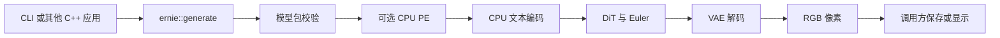

# 代码组织与依赖方向

本项目保留单模型 ncnn 项目的简洁布局，并将可复用生成接口与命令行分开。新增功能按模型组件归属，生成程序不承担下载、转换或数值验收。

## 参考项目与取舍

2026-09-06 核对了以下固定版本的实际目录、构建入口和流水线接口。这里比较的是适用的组织方式，不是开源项目的绝对排名。

| 项目 | 观察到的组织方式 | 本项目采用的部分 |
|---|---|---|
| [futz12/ernie-image-ncnn-vulkan](https://github.com/futz12/ernie-image-ncnn-vulkan/tree/8dcd6e4411137d8abe92c9d78581c4c96d5182c6/src) | CLI、`ernie_image_pipeline`、tokenizer 放在浅层 `src` 中 | 按推理职责命名文件，能直接找到模型组件 |
| [nihui/zimage-ncnn-vulkan](https://github.com/nihui/zimage-ncnn-vulkan/tree/c1938eef9cd7e03cb216da4f4c89a0c041543e7a/src) | `main`、`zimage_pipeline`、模型实现、`image_io` 和依赖构建文件分开 | 独立流水线、图像文件处理与依赖配置 |
| [leejet/stable-diffusion.cpp](https://github.com/leejet/stable-diffusion.cpp/tree/6b3edaaf32cc19e5bb2d819c788bd557eddc8eba) | `include` 公共接口、`src` 推理、`examples/cli` 和 `examples/server` 应用入口、独立 `cmake` | 公共接口不依赖 CLI，为后续 GUI/服务保留调用边界 |

本项目目前只有 ERNIE-Turbo，不需要引入多模型注册框架或插件层。第三方目录和代码仅作为结构参考，没有复制其运行时实现。

## 目录职责

```text
ernie-image-ncnn-vulkan/
├── CMakeLists.txt            # 构建选项、依赖、子目录
├── include/ernie/pipeline.h  # 应用侧 C++ 接口：请求、进度、RGB 结果
├── cli/                     # 参数、UTF-8 提示词文件、PNG、终端输出
├── src/                     # 推理实现，独立于命令行和 PNG 库
│   ├── pipeline.cpp         # 校验 → PE → 文本 → DiT → VAE
│   ├── prompt_enhancer.*    # 完整 PE 模型、采样与结束条件
│   ├── pe_session.*         # 原生 KV cache 会话、容量与生命周期
│   ├── text_encoder.*       # 文本嵌入、RoPE、25 层文本编码
│   ├── conditioning.*       # 文本补齐、DiT RoPE 和 mask
│   ├── denoiser.* / dit.*   # 去噪调度和一轮 DiT
│   ├── block_sequence.*     # 分块加载和设备激活传递
│   ├── vae.* / latent_ops.* # VAE 解码、latent 打包与 Euler
│   ├── ernie_*.{h,cpp}      # 经验证的 ncnn 算子与精度修正
│   ├── model_config.*       # 静态包尺寸与模型契约
│   └── tensor_io.*          # 诊断张量的读写
├── tokenizer/               # Rust C ABI、官方 Tokenizers、完整包校验
├── cmake/                   # 固定依赖与受散列约束的 shader 派生
├── probes/                  # 转换/诊断用原生程序
├── tools/                   # 下载、转换、打包、官方参考与验收脚本
├── tests/                   # 不需要下载权重的回归检查及小型 fixtures
├── docs/                    # 使用、复现、设计和当前限制
├── artifacts/               # 固定版本的报告、清单和测量证据
└── third_party/ncnn/        # 固定 revision 的独立依赖
```

`models/`、`outputs/`、`build*/` 是本地工作数据，不进入 Git。历史 artifact 保留其原始文件名和源码散列。

## 调用和内存边界



`ernie::generate` 返回像素和实际使用的提示词，通过回调报告进度，不解析参数、不打印终端、不写 PNG。调用者通过 `GenerationRequest` 明确选择模型、设备、精度及可选 trace。Vulkan 使用 ncnn 的进程级设备上下文，当前应串行调用生成接口。

PE 的 26 层和缓存全部释放后才开始图像文本编码；文本权重在 DiT 前释放；DiT 权重在 VAE 前释放。`PeSession` 只管理缓存，不负责模板、分词或采样。单 token 图使用原生不透明缓存句柄和独立 allocator，prefill 按实际 token 顺序执行，不把 padding 写入历史。

构建依赖为 `ernie-image → ernie::pipeline → ernie-runtime / ernie-pe / ernie-tokenizer`。只有 CLI 链接 libpng。公共接口头文件只依赖 C++ 标准库。`tests/test_pipeline_api.cpp` 作为外部调用者编译，不包含私有 ncnn 头。

## 构建和维护约定

根目录是唯一文档化构建入口；各目录自己的 `CMakeLists.txt` 管理该目录的目标。所有原生可执行文件仍生成在 `build/` 根目录，已有转换命令不需要改路径。日常开发默认构建回归测试和 probes。只构建用户程序时可追加：

```sh
-DBUILD_TESTING=OFF -DERNIE_BUILD_PROBES=OFF
```

未来 GUI 或服务可以链接 `ernie::pipeline`。当前支持源码树内的 CMake target；没有声明稳定的二进制 ABI 或已发布的 SDK。

新增推理功能先进入对应组件，再由流水线连接；CLI 只增加参数映射。转换和诊断脚本的任务入口见 [tools/README.md](../tools/README.md)。证据收集器统一使用 `tools/source_inventory.py`，记录 `include`、`cli`、所有子目录构建文件及实现源码，避免重构后遗漏版本信息。
