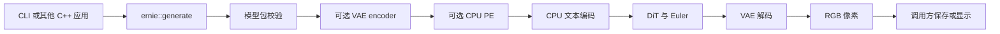

# 代码组织与依赖方向

本项目保留单模型 ncnn 项目的简洁布局，并将可复用生成接口与命令行分开。新增功能按模型组件归属，生成程序不承担下载、转换或数值验收。

## 参考项目与取舍

2026-09-06 核对了以下固定版本的实际目录、构建入口和流水线接口。这里比较的是适用的组织方式，不是开源项目的绝对排名。

| 项目 | 观察到的组织方式 | 本项目采用的部分 |
|---|---|---|
| [futz12/ernie-image-ncnn-vulkan](https://github.com/futz12/ernie-image-ncnn-vulkan/tree/8dcd6e4411137d8abe92c9d78581c4c96d5182c6/src) | CLI、`ernie_image_pipeline`、tokenizer 放在浅层 `src` 中 | 按推理职责命名文件，能直接找到模型组件 |
| [nihui/zimage-ncnn-vulkan](https://github.com/nihui/zimage-ncnn-vulkan/tree/c1938eef9cd7e03cb216da4f4c89a0c041543e7a/src) | `main`、`zimage_pipeline`、模型实现、`image_io` 和依赖构建文件分开 | 独立流水线、图像文件处理与依赖配置 |
| [leejet/stable-diffusion.cpp](https://github.com/leejet/stable-diffusion.cpp/tree/6b3edaaf32cc19e5bb2d819c788bd557eddc8eba) | `include` 公共接口、`src` 推理、`examples/cli` 和 `examples/server` 应用入口、独立 `cmake` | 公共接口不依赖 CLI，为后续 GUI/服务保留调用边界 |

本项目目前只有 ERNIE-Turbo，不需要引入多模型注册框架或插件层。第三方目录和代码仅作为结构参考，没有复制其运行时实现。

## 目录职责

```text
ernie-image-ncnn-vulkan/
├── CMakeLists.txt            # 构建选项、依赖、子目录
├── include/ernie/pipeline.h  # 应用侧 C++ 接口：请求、进度、RGB 结果
├── cli/                     # 参数、UTF-8 提示词文件、图像 I/O、终端及完成报告
├── src/                     # 推理实现，独立于命令行和 PNG 库
│   ├── pipeline.cpp         # 校验 → PE → 文本 → DiT → VAE
│   ├── prompt_enhancer.*    # 完整 PE 模型、采样与结束条件
│   ├── pe_session.*         # 原生 KV cache 会话、容量与生命周期
│   ├── text_encoder.*       # 文本嵌入、RoPE、25 层文本编码
│   ├── conditioning.*       # 文本补齐、DiT RoPE 和 mask
│   ├── denoiser.* / dit.*   # 去噪调度和一轮 DiT
│   ├── block_sequence.*     # 分块加载和设备激活传递
│   ├── weight_placement.*   # DiT 实时显存预算查询与 GPU/RAM 权重选择
│   ├── weight_session.*     # 请求内有界 RAM 权重复用、租约与内存压力回收
│   ├── host_memory.*        # 主机/cgroup 可用量与可回收文件页估计，独立于模型计算
│   ├── model_loading.h      # 运行时选择映射/文件读取，保留既有构建默认值
│   ├── image_encoder.*      # 已认证 encoder 图的 RGB→mean/packed/normalized
│   ├── img2img.*            # strength、保存噪声和原始 schedule suffix
│   ├── vae.* / latent_ops.* # VAE 解码、latent 打包与 Euler
│   ├── ernie_*.{h,cpp}      # 经验证的 ncnn 算子与精度修正
│   ├── model_config.*       # 静态包尺寸与模型契约
│   ├── model_package.*      # 原生包验证、实例选择与共享权重路径
│   ├── component_files.*    # 内存图文本/权重对象加载，兼容旧 probe 目录入口
│   ├── shape_graph.*        # 完整图身份与允许变化的形状字段
│   └── tensor_io.*          # 诊断张量的读写
├── tokenizer/               # Rust C ABI、官方 Tokenizers、完整包校验
├── cmake/                   # 固定依赖、经审查的构建目录派生与安装包导出
├── probes/                  # 转换/诊断用原生程序
├── tools/                   # 下载、转换、打包、官方参考与验收脚本
├── tests/                   # 不需要下载权重的回归检查及小型 fixtures
├── docs/                    # 使用、复现、设计和当前限制
├── artifacts/               # 固定版本的报告、清单和测量证据
└── third_party/ncnn/        # 固定 revision 的独立依赖
```

`models/`、`outputs/`、`build*/` 是本地工作数据，不进入 Git。历史 artifact 保留其原始文件名和源码散列。

## 调用和内存边界



`ernie::generate` 返回像素、实际使用的提示词、选中的包/文本配置和 Vulkan 设备索引，通过回调报告进度，不解析参数、不打印终端、不写 PNG。`cli/generation_report.*` 将这些标准 C++ 返回值写成可选的轻量完成记录，不引入 ncnn 或图像库依赖；`tools/benchmark_request.py` 复用已有的完整包校验和共享源选择来核对记录。调用者通过 `GenerationRequest` 明确选择模型、设备、精度及可选 trace。Vulkan 使用 ncnn 的进程级设备上下文，当前应串行调用生成接口。

PE 的 26 层和缓存全部释放后才开始图像文本编码；文本权重在 DiT 前释放；DiT 权重在 VAE 前释放。`PeSession` 只管理缓存，不负责模板、分词或采样。单 token 图使用原生不透明缓存句柄和独立 allocator，prefill 按实际 token 顺序执行，不把 padding 写入历史。

图像模型包由 `ModelPackage` 在 Rust 层完整验证，随后以 `ComponentFiles` 传递内存中的图文本与权重文件路径。文本编码、DiT heads/blocks、VAE encoder 和 VAE 解码使用同一加载边界；组件不解析 JSON，也不负责查找包。旧 probes 的目录参数通过适配器进入同一加载器。schema-3 将已审查的 512×384/s2048 与 1024×1024/s64 实例绑定到共享对象；不生成临时 param，不按尺寸复制权重。两个固定尺寸现在均允许附加经目标尺寸证据认证的 encoder；旧包继续显式报告 encoder unavailable，其他形状拒绝图生图。多实例生成必须指定宽高。512×384 共享实例的完整原生 PE→图像已经通过[独立质量复核](../artifacts/2026-09-06/shared-native-pipeline/README.md)，全部 25 个边界及 PNG 与原固定包逐位一致。1024×1024 生产 strength=0 重建的六个边界与 PNG 已通过[独立复核](../.superpowers/sdd/2026-09-06-surpass-reference/task-F2-strength0-1024-review.md)；此证据不覆盖正 strength 去噪或其他输入。

原生空间尺寸实例化继续沿用这一边界：`shared_package.rs` 完整验证至多三个源 manifest 后保留轻量文件索引，在真实分词后选择可容纳 token 的最小独立文本模板；不会再次读入整套权重。`ModelPackage` 保存源配置与目标配置，`ShapePlan` 检查范围、有效长度、padding 和大序列权重放置策略，`shape_graph.cpp` 只在内存中替换完整图指纹允许的字段。范围为轴长 16..2048、16 倍数、面积至多 2097152；完整出图矩阵仍待实测，见[当前证据](../artifacts/2026-09-07/runtime-range-and-buckets/README.md)。32-token 文本来源保留 64 个 DiT 文本槽；总长度超过 6144 时 Vulkan 权重放在系统内存。VAE encoder 的空间证据独立于文本模板，源尺寸编码器不会被误认为新尺寸可用。

构建依赖为 `ernie-image → ernie::pipeline → ernie-runtime / ernie-pe / ernie-tokenizer`。只有 CLI 链接 libpng。公共接口头文件只依赖 C++ 标准库。`tests/test_pipeline_api.cpp` 作为外部调用者编译，不包含私有 ncnn 头。

## 构建和维护约定

`cmake/ErnieModelReader.cmake` 提供默认关闭的读取缓冲区实验：先认证固定 ncnn 的 `modelbin.cpp`，只在构建目录生成两行元素计数修正，再替换该编译单元。它不修改第三方检出、不涉及权重放置或模型数学；`tests/test_model_reader.cpp` 直接调用实际 ModelBin，核对分配量、解码位模式、映射路径与文件截断。开关和验证范围见 [组件复现说明](REPRODUCE-COMPONENTS.md#普通读取的临时权重缓冲区实验)。

`weight_placement.*` 管理每个 DiT 组件加载前的权重放置决定：读取实际计算堆的 Vulkan 预算与本进程使用量，结合权重大小估计、可调余量及原有大序列偏好，选择 GPU 或系统内存。`WeightPlacement` 不持有模型权重、设备命令或后台线程；`block_sequence` 与 heads 仍负责在 GPU 完成后销毁 Net。API/CLI 只传递 auto/device/host 与余量，详细 trace 和返回值记录请求原因及计数。运行中激活迁移尚未实现。有界的跨步 RAM 权重复用由独立 `WeightSession` 管理，默认关闭；`host_memory.*` 负责 Linux 主机及 cgroup 余量读取。放置选择、缓存所有权和可用内存估计各自保持独立。

根目录是唯一文档化构建入口；各目录自己的 `CMakeLists.txt` 管理该目录的目标。所有原生可执行文件仍生成在 `build/` 根目录，已有转换命令不需要改路径。日常开发默认构建回归测试和 probes。只构建用户程序时可追加：

```sh
-DBUILD_TESTING=OFF -DERNIE_BUILD_PROBES=OFF
```

Windows 参数适配集中在 `cli/windows_main.cpp`；公共 API 的文本与路径字符串使用 UTF-8，组件在文件 I/O 边界转换为原生路径。Rust target、静态库命名和 Windows 系统库仍由 `tokenizer/CMakeLists.txt` 管理。当前 MinGW/Wine CPU 构建、实际小网络和迁移安装证据见[Windows 开发说明](BUILDING-WINDOWS.md)，原生 Windows/MSVC/GPU 与 macOS 验收仍开放。

未来 GUI 或服务可以链接 `ernie::pipeline`。`ERNIE_INSTALL_SDK=ON` 同时提供安装后的 `find_package(Ernie CONFIG REQUIRED)` 入口、公共头文件和必需的静态实现库。Linux CPU/Vulkan 均已在迁移前缀、隐藏源码与原构建、禁网后完成外部消费者链接及 API 检查，新增 ShapePlan 和运行统计依赖后已重新完成两种 SDK 的实际安装，并用安装版完成 512×512 原生离线出图，见[最新安装与实图验证](../artifacts/2026-09-07/runtime-images-and-sdk/README.md)。公共头文件不引入 ncnn/PNG，内部归档通过链接依赖保留；安装配置只使用同前缀固定 ncnn。尚未声明跨工具链稳定二进制 ABI、已公开发行的 SDK 或原生 Windows/macOS 安装通过。

新增推理功能先进入对应组件，再由流水线连接；CLI 只增加参数映射。转换和诊断脚本的任务入口见 [tools/README.md](../tools/README.md)。证据收集器统一使用 `tools/source_inventory.py`，记录 `include`、`cli`、所有子目录构建文件及实现源码，避免重构后遗漏版本信息。


`tools/check_release.py` owns the local Linux delivery check: bounded archive
verification, frozen case preparation, namespace isolation and a native process
supervisor. It reads the draft produced by `tools/build_release.py` and does not
change its publication/license state. `tests/test_check_release.py` covers the
archive and identity rejection contracts plus an actual small namespace test;
full-model runs remain separate evidence. `tools/release_dependencies.py` records
actual Linux target/loader/archive dependency identities without moving release
approval into inference or the public API.
