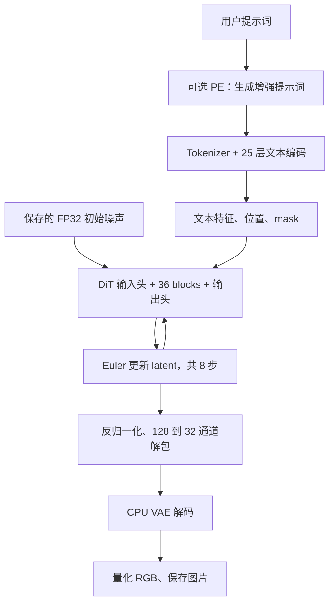

# ERNIE-Image-Turbo 分步移植：命令与完整说明

这里保留从组件转换到完整生成、误差定位和三平台验证的详细命令。较短的叙述版已发布在 [ncnn Discussions](https://github.com/Tencent/ncnn/discussions/6985)，日常编译与使用看 [README](../README.md)。

示例以仓库根目录和 Linux 转换环境为准。Python 用于模型准备与官方参考，转换完成后的原生程序不依赖 Python。文中的历史实验使用各自记录的程序、模型和保存噪声，数值失败与平台限制沿用原报告。

## 1. 先确定模型边界和参考版本

Turbo 默认 8 步、CFG=1、batch=1，适合先实现完整流程。模型由几个用途不同的组件组成：



PE 是自回归语言模型，可以暂时关闭。图像文本编码器提取提示词特征，不继续生成文字。DiT 则反复更新整张图的压缩表示。把三者分清后，KV cache、分词模板和 hidden-state 选择才有明确归属。

版本记录在 [sources.lock.json](https://github.com/mingshi2333/ernie-image-ncnn-vulkan/blob/codex/surpass-reference/sources.lock.json)：

| 依赖 | 本项目使用的版本或提交 | 作用 |
|---|---|---|
| ncnn | `3b7bdba7fc8aea8fd46779533eee027df77c639d` | CPU/Vulkan 原生执行；2026-09-08 升级，旧 `6a1bf000` 包保留来源并继续兼容 |
| pnnx | `20260526`，另记转换器二进制 SHA-256 | 转换组件图 |
| 官方 Turbo 权重 | `bc68c81e2a1730a394d5fc9fae70713dee940140` | 真实模型参数 |
| Diffusers | `7643c4826609c47755e3da0e5b768e8070468f49` | 分阶段官方参考 |
| Transformers | `5.2.0` | 官方文本路径与配置分派 |
| Tokenizers | Python/Rust 均为 `0.22.2` | 分词行为对照 |

转换器版本和运行时 ncnn 版本各自锁定。已有 `.param` 能加载，只说明文件格式可以识别，还需要核对模型公式、输入形状和输出。

## 2. 建立原生构建和 Python 转换环境

从验证分支克隆，初始化固定 ncnn 及其子模块：

```sh
git clone --branch codex/surpass-reference --recurse-submodules \
  https://github.com/mingshi2333/ernie-image-ncnn-vulkan.git
cd ernie-image-ncnn-vulkan
cmake -S . -B build -G Ninja -DCMAKE_BUILD_TYPE=Release \
  -DERNIE_ENABLE_VULKAN=ON -DNCNN_SYSTEM_GLSLANG=OFF \
  -DERNIE_BUILD_TOKENIZER=ON -DERNIE_BUILD_GENERATOR=ON \
  -DERNIE_INSTALL_SDK=ON -DNCNN_INT8=OFF -DNCNN_WEIGHT_QUANT=OFF
cmake --build build --parallel 2
ctest --test-dir build --output-on-failure
```

需要 C++17、CMake、Ninja、Rust/Cargo、libpng 和可用的 Vulkan 驱动。构建时不下载模型。这里构建全部目标，因为后续需要组件 probes；只想使用现成模型包时，可以只构建 `ernie-image`。

Python 环境用于下载、导出和官方参考。下面是已记录的 Linux CUDA 环境，不能直接把这份 CUDA 依赖清单当作 macOS 安装说明：

```sh
uv venv --python 3.14 .venv
uv pip install --python .venv/bin/python -r requirements-reference.lock
```

原生构建的无大模型测试与 Python 全模型验证是两条路径。前者检查算子、缓存、包校验和接口，后者会读取真实权重并产生参考张量。

## 3. 从一个真实 DiT block 开始

先下载第 0 层所需的权重，导出小输入，再比较 CPU/Vulkan 输出：

```sh
.venv/bin/python tools/fetch_component.py --block 0
.venv/bin/python tools/export_dit_block.py --output models/tutorial/block0-small
.venv/bin/python tools/run_block_matrix.py \
  --model models/tutorial/block0-small/runtime --output outputs/tutorial-block0-small
```

这一层使用真实学习权重，但 hidden states 和时间调制输入来自固定随机张量。它能检查 block 的转换语义，尚不能说明真实提示词生成正确。导出包装会先对比官方 `ErnieImageSharedAdaLNBlock`，再调用 pnnx，保留原始图、运行图和输入输出 fixture。

每个 block 的隐藏宽度为 4096，注意力有 32 个头，每头 128 维。注意力和 gated MLP 是两个残差分支，shared AdaLN 为每个分支提供 shift、scale、gate。这个块有几处必须保留的数学行为：

- Q/K 先各自 RMSNorm，再应用三轴 RoPE。
- 图像和文本使用非因果联合注意力，padding key 被屏蔽。
- MLP 的 GELU 使用 erf 公式。固定 ncnn 的 Vulkan GELU 近似公式与这里的目标不同，因此注册专用实现。
- ERNIE 的旋转布局与角度表需要一起检查，不能仅因为图上出现 sin/cos 就替换成标准 RotaryEmbed。

源码集中在 [export_dit_block.py](https://github.com/mingshi2333/ernie-image-ncnn-vulkan/blob/codex/surpass-reference/tools/export_dit_block.py) 和 [prepare_block.py](https://github.com/mingshi2333/ernie-image-ncnn-vulkan/blob/codex/surpass-reference/tools/prepare_block.py)。

小块通过后，再扩大序列，检查真实的形状和注意力工作区：

```sh
.venv/bin/python tools/export_dit_block.py --height 4 --width 4 \
  --text-tokens 272 --valid-text 270 --output models/tutorial/block0-288
.venv/bin/python tools/run_block_matrix.py \
  --model models/tutorial/block0-288/runtime --output outputs/tutorial-block0-288

.venv/bin/python tools/export_dit_block.py --height 64 --width 64 \
  --text-tokens 64 --valid-text 62 --output models/tutorial/block0-4160
.venv/bin/python tools/run_block_matrix.py \
  --model models/tutorial/block0-4160/runtime --output outputs/tutorial-block0-4160
```

这里的 `height/width` 是 latent 网格，64×64 对应 1024×1024 图片。一个小序列图的层列表与大图相同，不代表其中的 reshape、mask 和广播维度可以直接复用。

## 4. 接入真实 tokenizer 和文本编码

文本路径有两个容易混淆的地方：实际配置在锁定的 Transformers 中分派给 `MistralModel`；图像条件要的是 `hidden_states[-2]`，对应第 25 个 block 的输出。它不执行第 26 层或 final norm，也不加载视觉分支和 LM head。

```sh
.venv/bin/python tools/fetch_tokenizer.py
.venv/bin/python tools/fetch_pipeline_components.py
.venv/bin/python tools/audit_text_selection.py --output outputs/tutorial-text-selection
.venv/bin/python tools/export_text_block.py --tokens 32 --output models/tutorial/text-template-32
.venv/bin/python tools/build_text_weights.py --template models/tutorial/text-template-32 \
  --output models/tutorial/text-32 --embedding
.venv/bin/python tools/export_text_block.py --tokens 64 --output models/tutorial/text-template-64
.venv/bin/python tools/rebucket_text.py --source models/tutorial/text-32 \
  --template models/tutorial/text-template-64 --output models/tutorial/text-64
```

`audit_text_selection.py` 用完整的小尺寸模型和层钩子确认选择规则。真实权重的验证还要比较原生文本输出：

```python
import subprocess

command = ['.venv/bin/python', 'tools/validate_text.py',
           '--embedding-package', 'models/tutorial/text-32',
           '--prompt', 'A red apple on a wooden table, soft daylight, realistic photo.',
           '--output', 'outputs/tutorial-real-text']
for i in range(25):
    command += ['--model', f'models/tutorial/text-64/block-{i:02d}']
subprocess.run(command, check=True)
```

token IDs 先与官方逐项比较，然后比较 3072 维 hidden states。已测中文 IDs 与官方一致，不能把后续图片偏差直接解释成中文分词错误。

静态文本桶长、有效 token 数和 DiT 文本槽是三个量。原生程序按真实分词结果选可容纳的桶，执行后只取有效行，再补到 DiT 的槽数并准备 mask。source32 的共享包仍保留 64 个 DiT 文本槽。

## 5. 转换其余层，保留真实激活的 FP32 残差

已检查的模板可以用于转换 36 层的独立权重：

```sh
.venv/bin/python tools/convert_dit_blocks.py \
  --template models/tutorial/block0-288/runtime --start 0 --end 36 \
  --keep-going-on-numerical-failure --output models/tutorial/dit-288
```

这个诊断选项遇到数值未通过项会继续检查其他层，最终仍返回非零；下载失败、转换失败和执行崩溃仍停止。历史 BF16 独立块 31、33、35 有失败记录，需要按精度读取结果。

真实文本接入后，出现过小随机输入没有暴露的问题：残差激活超过 FP16 最大有限值 65504。单纯把权重保留为 FP32，或只修改 Euler 更新，无法阻止块内溢出。当前在两个残差加法点使用 `ErnieResidualAdd`，保留 FP32 skip；归一化临时计算也使用 FP32，归一化后的投影输入再回到模型存储精度。

为 1024 的图准备这些约定：

```python
import subprocess

command = ['.venv/bin/python', 'tools/rebucket_dit.py',
           '--template', 'models/tutorial/block0-4160/runtime',
           '--fp32-residual', '--output', 'models/tutorial/dit-4160-residual']
for i in range(36):
    command += ['--model', f'models/tutorial/dit-288/block-{i:02d}/runtime']
subprocess.run(command, check=True)
```

这里复用经过校验的学习权重，目标图来自独立导出的目标形状。单个组件通过检查后，还需要验证 36 层串联后的完整去噪轨迹，第 11 步给出对照方法。

## 6. 加上输入头、时间调度和 latent 更新

```sh
.venv/bin/python tools/export_dit_heads.py --download --height 64 --width 64 \
  --text-tokens 64 --output models/tutorial/heads-4160
.venv/bin/python tools/validate_dit_heads.py \
  --model models/tutorial/heads-4160/input --output outputs/tutorial-heads-input
.venv/bin/python tools/validate_dit_heads.py \
  --model models/tutorial/heads-4160/output --output outputs/tutorial-heads-output
```

以 1024×1024 为例，去噪 latent 的逻辑形状为 `[128,64,64]`。输入头将 4096 个图像位置各自投影到 4096 维，再与 64 个文本位置拼接，联合长度为 4160。注意力为：

```text
softmax(Q K^T / sqrt(128) + padding_mask) V
```

RoPE 将 128 个维度分给三个轴，分别为 `[32,48,48]`。有效文本长度为 T 时，图像 `(y,x)` 的位置为 `(T,y,x)`，文本 j 的位置为 `(j,0,0)`。频率计算保留足够精度，避免 BF16 在较大位置编号处合并相邻坐标。

时间特征先经过正弦/余弦编码和学习层，产生本步共享的六组调制向量。Turbo 的数学调度如下，S 默认是 8：

```text
s_i         = 1 - i/S                    # i = 0..S-1
sigma_i     = 4*s_i / (1 + 3*s_i)
sigma_S     = 0
timestep_i  = 1000*sigma_i
v_i         = DiT(z_i, text, timestep_i)
z_{i+1}     = z_i + (sigma_{i+1} - sigma_i)*v_i
```

`v_i` 是流速度预测。sigma 下降，所以 Euler 的差值为负。主 latent 始终是 FP32。代码还保留官方 FP32 linspace 和乘加的求值顺序，避免数学等价改写额外引入舍入差异。实现位于 [latent_ops.cpp](https://github.com/mingshi2333/ernie-image-ncnn-vulkan/blob/codex/surpass-reference/src/latent_ops.cpp) 和 [denoiser.cpp](https://github.com/mingshi2333/ernie-image-ncnn-vulkan/blob/codex/surpass-reference/src/denoiser.cpp)。

## 7. 处理 VAE 的转换、归约精度和工作区

高分辨率 VAE 曾在整图 pnnx 导出时持续增长主机内存。实际使用的路径是先导出小图，再对固定图中经过完整散列审查的两处空间 reshape 做特化，同时独立执行目标分辨率的官方参考：

```sh
.venv/bin/python tools/export_vae.py --height 8 --width 8 --output models/tutorial/vae-8
.venv/bin/python tools/validate_dit_heads.py \
  --model models/tutorial/vae-8 --output outputs/tutorial-vae-8
.venv/bin/python tools/export_vae.py --height 128 --width 128 --reference-only \
  --output models/tutorial/vae-128-reference
.venv/bin/python tools/specialize_vae.py --template models/tutorial/vae-8 \
  --reference models/tutorial/vae-128-reference --output models/tutorial/vae-128
.venv/bin/python tools/validate_dit_heads.py --model models/tutorial/vae-128 \
  --cpu-only --vae-convolution direct --output outputs/tutorial-vae-128
```

这里 128×128 是 32 通道 VAE 输入，解码后为 1024×1024。特化只覆盖已审查的 flatten/unflatten，不能推广成任意 VAE 图都能改两个参数。

解码前先按模型包的 128 通道统计量执行 `z*sqrt(variance+1e-5)+mean`，再把每组四通道重排回一个通道的 2×2 空间位置。VAE 输出映射到 `[0,1]`，裁剪、乘 255，再按 `nearbyint` 量化。

另一个真实失败来自 CPU GroupNorm 的大尺寸归约。仅关闭 Winograd 没有修好数值误差；均值与中心方差改用 FP64 归约后，独立 1024 VAE 的 NRMSE 为 `9.41e-7`。其余激活和 affine 运算仍为 FP32。

默认 CPU VAE 使用直接卷积。旧 1024 苹果完整运行的峰值 RSS 为 23.03 GiB，采用直接卷积后的记录为 5.82 GiB。这是指定实现和样例的资源记录，不能推导所有机器都需要相同内存，或直接卷积总是更快。[完整转换与 VAE 证据](https://github.com/mingshi2333/ernie-image-ncnn-vulkan/blob/codex/surpass-reference/docs/REPRODUCE-PIPELINE.md)

## 8. 组装模型包并生成第一张图

前面的目录现在可以组装成同一个 1024 模型。下面的 Python 段在仓库根目录执行：

```python
import subprocess

command = ['.venv/bin/python', 'tools/prepare_pipeline.py',
           '--input-head', 'models/tutorial/heads-4160/input',
           '--output-head', 'models/tutorial/heads-4160/output',
           '--vae', 'models/tutorial/vae-128',
           '--embedding-package', 'models/tutorial/text-32',
           '--output', 'models/tutorial/pipeline-1024']
for i in range(36):
    command += ['--dit', f'models/tutorial/dit-4160-residual/block-{i:02d}']
for i in range(25):
    command += ['--text', f'models/tutorial/text-64/block-{i:02d}']
subprocess.run(command, check=True)
```

开发包可以链接已准备的权重。要搬到另一台机器，生成包含实际文件的独立包：

```sh
python3 tools/package_model.py --model models/tutorial/pipeline-1024 \
  --output models/tutorial/turbo-portable
build/ernie-image --model models/tutorial/turbo-portable --verify-model
build/ernie-image --model models/tutorial/turbo-portable \
  --prompt 'A red apple on a wooden table, soft daylight, realistic photo.' \
  --precision fp32 --output outputs/tutorial-apple.png \
  --report-json outputs/tutorial-apple.json
```

原生加载会校验文件长度、SHA-256、模型来源和配置。标准 schema-2 文生图包包含 136 个运行文件，不能直接把官方 `.safetensors` 目录传给 CLI。再次运行时使用新输出路径，保留之前的图片和报告。

后续的 schema-3 共享包将相同权重存为内容寻址对象，由已验证的源包提供图模板，按尺寸和真实 token 数实例化图。它减少重复模型文件，但每种新形状仍需要自己的执行检查；图生图还需要经过验证的 VAE encoder。

## 9. 在有限显存上保持可执行

第一层优化是安排权重生命周期：文本阶段完成后释放文本模型，DiT 每次保留当前块，VAE 在 DiT 结束后加载。块间激活保留为 `VkMat`，通过 `VkCompute` 提交；确认本块命令完成后才能销毁它的权重。共享 Vulkan pipeline cache 复用着色器管线信息。

第二层是权重放置。加载组件前查询显存预算，结合权重估计和预留空间，选择设备内存或主机可见 RAM。RAM 权重仍供 Vulkan 计算。可选 RAM 权重缓存有独立容量和余量检查，默认关闭。

第三层是注意力工作区。4160 个位置、32 个头的完整 FP32 分数矩阵需要：

```text
32 * 4160 * 4160 * 4 bytes ≈ 2.06 GiB
```

每次只处理最多 128 个 query，同一块缓冲区变为：

```text
32 * 128 * 4160 * 4 bytes = 65 MiB
```

每个 query 仍读取完整 K/V，代价是更多提交和同步。这里是单个分数缓冲区的大小，实际显存还包括权重、Q/K/V、输出和其他工作区。曾发生过整矩阵 FP32 路径分配失败和崩溃，不能把后来的分块成功说成原路径从未出问题。

FP32 注意力还对 softmax 分母和概率乘 V 的长求和使用 Kahan 补偿。派生 shader 先将 Windows CRLF 换行统一为 LF，再核对完整源码的 SHA-256，并从同一份文本派生，ncnn 升级时必须重新审查。低精度 Flash 路径与原生缓存路径保留原行为。[注意力实现](https://github.com/mingshi2333/ernie-image-ncnn-vulkan/blob/codex/surpass-reference/src/ernie_attention.cpp)

在这之后，执行层补上三个机制，详细的参数和代码见[内存执行教程](MEMORY-EXECUTION.md)：

1. 在当前块执行前用一个 `std::future` 启动下一块的独立 Net 准备。默认关闭；启用要求 Vulkan FP32 和 auto/host 权重，例如 `--precision fp32 --dit-weights auto --dit-prefetch-mib 1024`。启动前检查估计和 RAM 余量，完成后核查实际权重驻留与预算；主线程统一处理缓存和日志。提交与等待串行化以兼容只有一个队列的设备，CPU 准备仍可重叠。
2. 为新的激活和工作区缓冲区选择设备内存或主机可见 RAM。RAM 上限按 Vulkan 实际分配大小计费，待 GPU 命令完成后才真正释放临时缓冲区。GPU 继续运行原着色器。
3. 完成每次 Euler 更新后下载 FP32 潜变量。只在明确的分配错误后重建 session，从最近成功步骤继续；最多三次，关闭额外缓存和预取，并逐级减小 FP32 非 Flash 查询分块。所有查询仍使用完整 K/V，不改变输出尺寸、步数或精度。

低层失败需要可靠地传播到这里。原 ncnn 的部分上传路径会丢失错误或继续使用空分配，因此项目在经过源码散列核验的构建副本中补齐错误分类、清理和队列等待。设备丢失、模型错误和观察器回调错误不进入恢复。权重文件映射、缓存、预取和 RAM 缓冲区仍分别记录成本；成功恢复不是提速证明。

这些机制覆盖 DiT 的 buffer，不能任意迁移正在运行的激活，也不覆盖文本、PE、VAE 或进程重启。当前 macOS 缺少生产 RAM 余量读取器，Windows Job/Wine 也返回余量未知，所以这些场景拒绝 host 缓冲区准入，包括显式 host 模式；微型测试注入余量不等于生产支持。恢复只处理已保留类型的 buffer/command 等路径，compute pipeline 等创建操作若仍被 ncnn 压成通用 `-1`，就直接结束；失败清理同步本身报错时也不重试。

同输入 512×512、8 步 FP32 的正常和混合内存两例，各 25 个张量及 PNG 都与原基线逐位相同。混合配置实际使用了 43,655 次 device 和 288 次非 device-local host 分配，host 峰值 192 MiB，预取 280/280 被消费。正常/混合的本次耗时为 258.230/420.948 秒，后者更慢；显存预留、缓存和预取同时变化，页缓存未控制，不能把重叠或命中率当成加速证据。完整模型没有触发重试；检查点恢复的证据来自实际微型 Vulkan 图的故障注入。[完整记录](https://github.com/mingshi2333/ernie-image-ncnn-vulkan/blob/codex/surpass-reference/artifacts/2026-09-08/memory-execution/README.md)

校验也发现了 BF16 SDPA/Gemm 的 cooperative shader 使用设备未声明支持的 BF16 accumulator 类型。当前分别核对来源，在 ncnn target 内编译兼容副本，选择原生 BF16 Flash/普通 Gemm；submodule 不变，FP32/FP16 分支不变。新增四种 Gemm 形状的独立 FP64/BF16 RNE 测试证明，旧路径可以数值精确且退出 0，却仍有 VUID，修正后才同时通过。新 BF16 完整模型没有校验错误，但旧门槛仍只有 17/25、PNG MAE 1.294207255/max 143，必须保留实验状态。这说明运行有效、数值一致和性能收益需要分别验证。

## 10. 可选 PE 使用 ncnn 原生 KV cache

PE 执行完整的 26 层 Ministral3、final norm 和 tied LM head，使用自己的 tokenizer 与 chat template。它的 token-by-token 生成可以复用因果历史 K/V。

`PeSession` 为每个会话持有独立 cache allocator，设置容量 hint，CPU 侧通过 `extract(..., type=1)` 保留 ncnn 原生不透明缓存句柄。下一轮输入消费缓存后，再接回更新的句柄；重置时先释放缓存再销毁 allocator。浅拷贝不能作为两个独立会话。

已保存的真实 greedy 样例完成 315 个输出 token 至 EOS，文字/IDs 一致，每步 logits 通过固定门槛。正常入口仍逐 token 预填充。内部 1..32-token chunk 候选只有真实单层对照，没有完整 26 层收益结果，因此没有提升为默认。

DiT 的隐藏状态会随去噪步变化，联合注意力里的文本状态也变化，前一步 K/V 不能直接作为下一步的精确结果复用。当前 ncnn 的 KV 接口能用于 PE，不会自动消除 DiT 的八次计算。[缓存会话代码](https://github.com/mingshi2333/ernie-image-ncnn-vulkan/blob/codex/surpass-reference/src/pe_session.cpp)

## 11. 用相同输入定位误差

先保存同一份初始 FP32 噪声，再分别运行官方与原生实现。C++ 和 PyTorch 即使 seed 相同，也不保证采样出相同噪声。参考端先在独立进程中执行、退出，再启动原生 Vulkan，避免 CUDA context 与 Vulkan 同时争用显存。

```sh
.venv/bin/python tools/validate_pipeline.py --model models/tutorial/turbo-portable \
  --reference-device cuda --precision fp32 --output outputs/tutorial-full-parity
```

这里的官方参考使用锁定组件，DiT 按块在 CUDA FP32 执行并关闭 TF32，其余阶段采用 CPU FP32。它不是官方默认 BF16 运行的逐位一致性声明。

验证器保存文本条件、位置、每步预测与 latent、解包、decoded 和 PNG，分别计算 NRMSE 与最大绝对差。最终图片再计算 RGB 通道 MAE 和最大通道差，原始范围为 0..255。

完整轨迹未通过时，先找差异明显增长的步骤，再用官方输入重放该步：

```sh
.venv/bin/python tools/diagnose_pipeline_step.py \
  --model models/tutorial/turbo-portable --reference outputs/tutorial-full-parity/reference \
  --step 6 --precision fp32 --output outputs/tutorial-step6
```

单步改善说明输入传播可能影响结果，还需要用相同 hidden states、调制、mask 和位置表进一步隔离 block。768 样例的晚期预测在官方输入上接近很多，但最初完整轨迹的 18/25 判定仍保留。把官方文本特征直接传给原生端同样属于诊断，不能算作完成原生文本编码。

数值门槛由本项目在实验中定义，不是 ERNIE 或 ncnn 官方质量标准。后端运算顺序会造成舍入差异，但仅凭这个一般机制不能排除移植错误。每次诊断保留原输出、参数、程序身份和失败门槛。[数值诊断约定](https://github.com/mingshi2333/ernie-image-ncnn-vulkan/blob/codex/surpass-reference/docs/NUMERICAL-DIAGNOSTICS.md)

下面摘录已保存的完整原生文生图结果，均为 8 步、CFG=1、PE 关闭；CPU 文本与 VAE、Vulkan DiT。苹果使用 source32、15 个有效 token、64 个 DiT 文本槽，程序快照为 `92559ea4`、源码基线为 `990e8ef`。中文行来自各自更早的固定配置，不能据此隔离语言本身。

| 样例 | DiT 精度 | RGB MAE，0..255 | 最大通道差 | 张量检查 |
|---|---|---:|---:|---:|
| 苹果 512×512 | FP32 | 0.000361125 | 1 | 25/25 |
| 苹果 768×768 | FP32 | 0.027716743 | 2 | 18/25 |
| 苹果 1024×1024 | FP32 | 0.000761032 | 1 | 24/25 |
| 苹果 2048×1024 | FP32 | 0.001831373 | 1 | 25/25 |
| 中文 1024×1024 | FP32 | 0.022625605 | 13 | 21/25 |
| 1080-token 中文 512×384 | FP32 | 0.082126194 | 17 | 19/25 |
| 同一 1080-token 中文 | BF16 | 10.376324124 | 255 | 11/25 |

来源：[512 实图](https://github.com/mingshi2333/ernie-image-ncnn-vulkan/blob/codex/surpass-reference/artifacts/2026-09-07/runtime-images-and-sdk/README.md)、[方图](https://github.com/mingshi2333/ernie-image-ncnn-vulkan/blob/codex/surpass-reference/artifacts/2026-09-07/runtime-squares/README.md)、[大图](https://github.com/mingshi2333/ernie-image-ncnn-vulkan/blob/codex/surpass-reference/artifacts/2026-09-07/runtime-large/README.md)、[中文 FP32](https://github.com/mingshi2333/ernie-image-ncnn-vulkan/blob/codex/surpass-reference/artifacts/2026-09-06/attention-parity/README.md)、[长中文与 BF16](https://github.com/mingshi2333/ernie-image-ncnn-vulkan/blob/codex/surpass-reference/artifacts/2026-09-06/features-and-structure/README.md)。像素平均差很小可以与个别张量未通过同时成立，不能互相替代。

## 12. 把模型代码整理成可复用的原生程序

公开接口只暴露请求、RGB 结果和回调，避免把 ncnn 的私有类型带给使用者。目录按职责划分：

| 位置 | 负责内容 |
|---|---|
| `include/ernie/pipeline.h` | 公共 C++ API |
| `cli/` | 参数、UTF-8 提示词、图片 I/O 与报告 |
| `src/pipeline.cpp` | 阶段连接与资源交接 |
| `src/denoiser.cpp`、`dit.cpp`、`block_sequence.cpp` | Euler、单次 DiT、逐块执行 |
| `src/pe_session.cpp` | PE 的原生 KV 会话 |
| `src/weight_placement.cpp`、`weight_session.cpp` | 权重位置与有界 RAM 缓存 |
| `src/vulkan_memory.cpp`、`vulkan_denoise.cpp` | 激活缓冲区放置、CPU 检查点与有限恢复 |
| `tokenizer/` | Rust tokenizer 与模型包验证 |
| `tools/`、`probes/`、`tests/` | 模型准备、数值诊断与回归检查 |

CLI 与外部应用调用同一个 `ernie::generate`。安装后，外部项目使用 `find_package(Ernie 0.1.0 EXACT CONFIG REQUIRED)` 和 `ernie::pipeline`。安装检查还会移动带中文和空格的前缀，再构建外部调用者，检查是否残留源码目录依赖。

## 13. 验证三平台的原生程序

Linux、Windows 和 macOS 各自编译并运行测试。Windows 使用 MSVC 原生程序，macOS 使用 Apple Clang；Linux 上的 MinGW/Wine 检查另行保留。

跨平台容易漏掉的地方包括：

- Rust 静态库必须与 C++ 使用相同目标和兼容运行库；MSVC 的 `.lib` 与 GNU 的 `.a` 命名不同。
- Windows 命令行入口从 UTF-16 转 UTF-8，文件边界再转为原生路径；只测试英文路径发现不了这类问题。MSVC 源码与执行字符集明确设为 UTF-8。
- 安装后的库要保留系统链接依赖，并能在移动后的前缀中被找到。仅运行构建目录里的程序不覆盖这个问题。
- GPU 测试依赖真实驱动能力。没有可用设备时记录 skip，不能把 CPU 测试通过写成 Vulkan 推理通过。

[三平台工作流](https://github.com/mingshi2333/ernie-image-ncnn-vulkan/blob/codex/surpass-reference/.github/workflows/build.yml)构建 CLI、组件、原生 tokenizer 和 SDK，执行小型算子、缓存、Unicode、包校验以及独立消费者测试，保存 CTest XML 和日志。完整模型不放入每次 CI；下载权重和数 GB 激活也不适合用普通构建任务代替硬件验证。

这次原生 CI 发现了本机 Linux 和 Wine 检查未暴露的问题。处理顺序是保留失败日志、缩小到具体边界、修改对应代码或环境，再在失败的平台复查：

| 失败现象 | 定位与修复 |
|---|---|
| Windows 配置时拒绝固定 ncnn shader | Git 检出为 CRLF 后，原始字节摘要变化。统一 CRLF 为 LF 后核对原来的完整摘要，并从同一文本派生 shader；真实源码变化仍被拒绝。可选模型读取器使用相同规则。 |
| Windows PE 模板与预填充图检查拒绝合法夹具 | 这些文件有固定的字节身份，仓库通过 `.gitattributes` 将 `.jinja` 和 `.param` 夹具保持为 LF。运行时继续使用完整模板/图校验。 |
| MSVC 找不到 `std::stoi` | `model_config.cpp` 漏了 `<string>`。补齐直接依赖，避免依赖其他标准库头文件间接声明。 |
| macOS 搬移 SDK 后仍引用 ncnn 源码目录 | 固定 ncnn 的 simplevk 路径带出源目录内的 `.tbd`。macOS 默认通过系统 Vulkan loader 链接，并用 MoltenVK ICD 指定驱动；同时恢复缺失驱动测试的预期行为。 |
| macOS 执行第一个小型 Vulkan 网络即崩溃 | LLDB 栈位于 ncnn 创建占位图像时的 MoltenVK/Apple Paravirtual 路径，尚未进入 ERNIE 算子。CI 使用 loader，并设置 `MVK_CONFIG_USE_MTLHEAP=0` 后，小型 Vulkan 测试通过。这个设置限定于托管虚拟 GPU 验证环境。 |
| Windows 临时 vector 分配检查失败 | [MSVC 对大分配额外保留对齐空间](https://github.com/microsoft/STL/blob/main/stl/inc/xmemory)。测试使用相同标准库的空 vector 按规定元素数 `resize` 作为分配对照，分别记录元素字节与底层请求；解码逐位精度和读取边界检查保持不变。 |
| macOS 下载测试在请求发出前拒绝临时目录 | 系统 `/var` 指向 `/private/var`，测试夹具先取得实际目录路径；下载器继续拒绝用户指定的软链接输出和祖先目录，并增加独立回归检查。 |

`MVK_CONFIG_USE_MTLHEAP=0` 选择普通 Metal 分配，参数定义见 [MoltenVK 配置说明](https://github.com/KhronosGroup/MoltenVK/blob/v1.4.2/Docs/MoltenVK_Configuration_Parameters.md#mvk_config_use_mtlheap)。本次一起调整了 loader 和托管 GPU 的分配设置；结果证明该配置能运行，没有完成对两个设置各自作用的独立对照。物理 Mac 的默认行为和完整模型出图仍需要实机记录。

升级到 ncnn `3b7bdba7` 后，源码 `a495443` 的五个原生 CI 作业全部成功：Linux 两个 CPU 配置各 36 项通过；Linux Mesa Vulkan 与 macOS MoltenVK 各 53 项通过、4 项因 CI 驱动缺少原生 BF16 storage 能力而跳过；Windows MSVC 为 36 项通过、21 项因无 Vulkan 驱动跳过。每个作业另有 23 项本地 HTTP/清单检查通过，并实际通过旧模型包兼容与重打包来源保留检查。完整源码 SHA、原始失败和跳过名称见 [平台验证记录](https://github.com/mingshi2333/ernie-image-ncnn-vulkan/blob/codex/surpass-reference/docs/PLATFORM-VALIDATION.md)。三平台编译/测试与三平台真实模型出图是不同的结果。

这 4 项 BF16 跳过属于 CI 环境的驱动能力限制：驱动报告 `bf16-p/s=1/0`，测试在运行前的能力检查阶段返回 `77`。本机 RTX 4060 Laptop 报告 `bf16-p/s=1/1`，同样四项已实际执行并通过。

2026-09-09 内存执行最终源码 `7296bfe` 的[五个 CI 作业](https://github.com/mingshi2333/ernie-image-ncnn-vulkan/actions/runs/34373124004)也全部成功：两个 Linux CPU 配置各 37 项通过，Linux Vulkan/macOS 各 57 项通过和 5 项 BF16 能力跳过，Windows 37 项通过和 25 项无驱动跳过，均无失败。新增 Gemm 测试使 BF16 跳过从 4 变为 5；本机 RTX 4060 的 62 项实际测试全部通过，没有跳过。Linux Vulkan CI 还遇到旧 1.3.275 校验层不认识新的特性结构，现按官方摘要固定隔离的 SDK 1.4.357.1 校验层，未替换系统 loader/Mesa 或屏蔽 VUID。原失败日志与最终 XML 均保留。

默认 FP16 也完成独立冻结的 512×512、8 步回归：命令不指定精度，报告确认为 FP16，25 份张量及 PNG 与旧 FP16 逐位一致。官方参考仍为 23/25、PNG MAE 0.235983531/max 109，保持原未通过项。它验证公共内存改动没有改变这一固定样例的默认输出，没有把默认精度改成 FP32 或放宽门槛。

目前后续工作主要是扩大独立提示词验证、继续定位残余数值偏差，以及补充其他设备上的完整出图记录。新增的 DiT RAM 缓冲区与分配恢复有明确的预算和平台边界；近似 DiT 缓存仍未作为已有能力提供。
